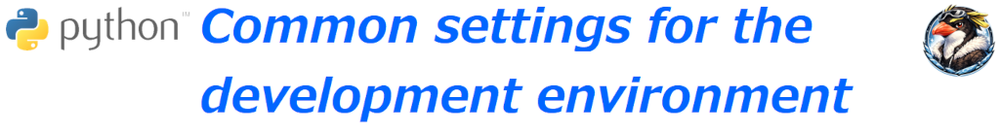
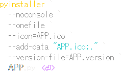
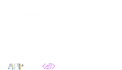
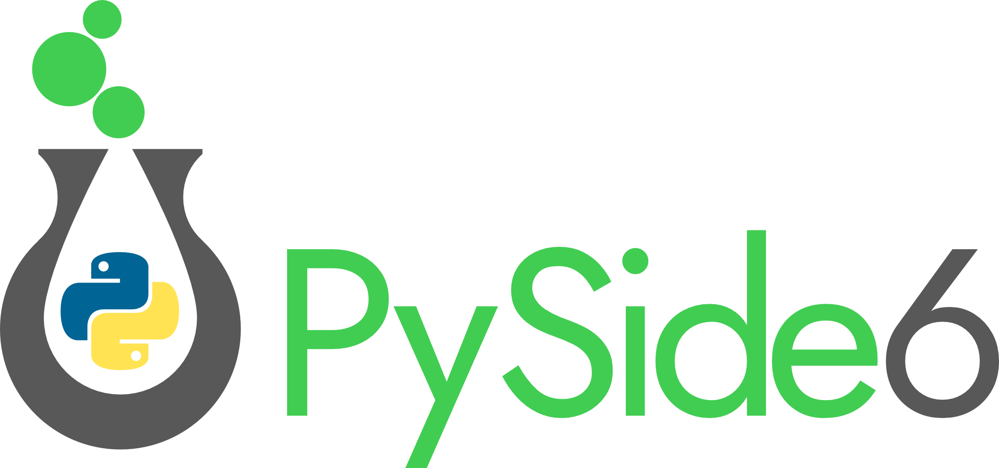
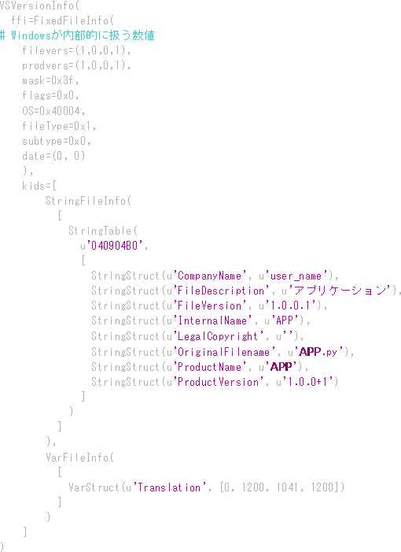
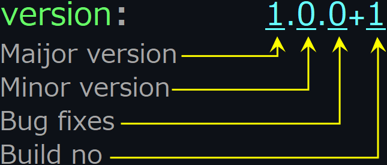

<p align="left">
  
  
</p>
<!--
  
-->

## Overview
### 記号の説明  
　各アプリケーションの開発手順で共通の項目を記載しています。

### Symbol Legend  
|Item|Content|Remarks|  
|:--|:--|:--|  
||デスクトップ||
||マウスクリック|右  : 右クリック、 W  : ダブルクリック|  
||次の動作|右側の動作を続けて行う|  
||ターミナル||  
||コピー| でコピー or コピー可能文字列表示|  
||ダウンロード||  
||インフォメーション|マウスカーソルが  に変化した場合、 で詳細表示|  
||テキスト|･･･ は文字列|
||ボタン|･･･ はボタン名|  
||ウィンドウ/メニュー/フォーム|･･･ はメニュー項目
||キーボードの Key を押す|･･･ はKey名、  : Enter Key|  

## 仮想環境構築
　Pythonによるアプリケーションの開発は仮想環境(virtualenv)以下で実施する事を推奨します。  
　  
> [!CAUTION]
> Ubuntu / Debian系のDistributionではパッケージ管理システム(**pip**)がインストールパッケージに含まれていない場合があります。  
> 予め`python3 --version`コマンドでpipのインストール状態を確認し、必要ならインストールして下さい。  
> pip Install command : `sudo apt install python3-pip`   

仮想環境は下記コマンドで実装し、有効化します。  
|Item|||remarks|  
|:--|:--|:--|:--|  
|コマンド抑止の<br>バイパス設定|Set-ExecutionPolicy -Scope Process<br> -ExecutionPolicy Bypass ||おまじない？|  
|仮想環境(VE)実装|py -m venv "VE名" |||  
|仮想環境有効化|source VE-DIR/bin/Activate |.\VE-DIR\Script\Activate.ps1 ||
|パッケージ管理アップデート|pip install -U pip |||  
|拡張機能インストール|pip install 拡張機能 ||␣ 区切りで<br>複数指定可能|  

## 単体起動アプリケーション(.exe)作成
### アプリケーション作成ツール  
　  
　　[ HomePage](https://pyinstaller.org/)　[ Manual](https://pyinstaller.org/en/stable/)  

  
<details>                                             <!-- pyinstaller PowerShell -->  
<summary>
　  
　  
　</summary>  
  
```  
pyinstaller `
  --noconsole `
  --onefile `
  --icon=APP.ico `
  --add-data APP.ico;." `
  --version-file=APP.version `
　APP.py
```  
</details>  

　 `.exe` は  : ./dist に作成されます。

  
<details>                                             <!-- pyinstaller PowerShell -->  
<summary>
　  
　
</summary>  
  
```  
pyinstaller \
  --noconsole \
  --onefile \
  --icon=APP.ico \
  --add-data APP.ico:." \
  --version-file=APP.version \
　APP.py
```  

</details>  
<br>

> [!caution]
> "APP " : アプリケーション名 (各名称に置き換えて下さい )  
> コマンド接続子が  と  で異なります。  
> 　 : "  " 、 : "  "  
> 　"--add-data" 中の文字、 : " , "、 : " . "  
>  の場合は `--collect-all PySide6` を追加する事。


### アイコンファイル作成
　pyinstallerで付加される標準アイコンは  です。  
　固有アイコンを使用する場合は 256,128,96,64,48,32,16Pixel の各解像度の画像を1つの`.ico`ファイルに作成します  
　　(128,64Pixelは他のサイズで代用可能なため、`.exe`容量を削減する場合は省略可)。  
> [!tip]  
> `.ico` 作成 / 編集ツール  
> 　 [](https://greenfishsoftware.org/)

### Version ファイル作成  
　Pyinstaller で使用されるVersionをファイルで指定します。  
　 名: `APP.version`  

<details>                                                           <!-- APP.version -->
<summary>
　  

　[](./assets/env/M_FILE_version.png)
</summary>  
  
```  
VSVersionInfo(
  ffi=FixedFileInfo(
# Windowsが内部的に扱う数値版
    filevers=(1,0,0,1),
    prodvers=(1,0,0,1),
    mask=0x3f,
    flags=0x0,
    OS=0x40004,
    fileType=0x1,
    subtype=0x0,
    date=(0, 0)
    ),
    kids=[
        StringFileInfo(
          [
            StringTable(
              u'040904B0',
              [
                StringStruct(u'CompanyName', u'user_name'),
                StringStruct(u'FileDescription', u'アプリケーション'),
                StringStruct(u'FileVersion', u'1.0.0.1'),
                StringStruct(u'InternalName', u'APP'),
                StringStruct(u'LegalCopyright', u''),
                StringStruct(u'OriginalFilename', u'APP.py'),
                StringStruct(u'ProductName', u'APP'),
                StringStruct(u'ProductVersion', u'1.0.0+1')
              ]
            )
          ]
        ),
        VarFileInfo(
          [
            VarStruct(u'Translation', [0, 1200, 1041, 1200])
          ]
        )
    ]
)
```  

</details>

　バージョン内容  
　　
|Version Name|Details of Add-ons|  
|:---|:---|  
|Major version|主要機能の追加|  
|Minor version|機能変更、小規模追加|  
|Bug fixes|バグ対策|  
|build no|機能変更を伴わない修正、内部的なバグ対策|  


<br>  
<br>  
<br>  
<br>  

# Download the Release 
　各アプリケーションの単体起動版(.exe)は下記リンクよりダウンロードできます。  
　　 https://github.com/AHazeyama/public/releases/latest
