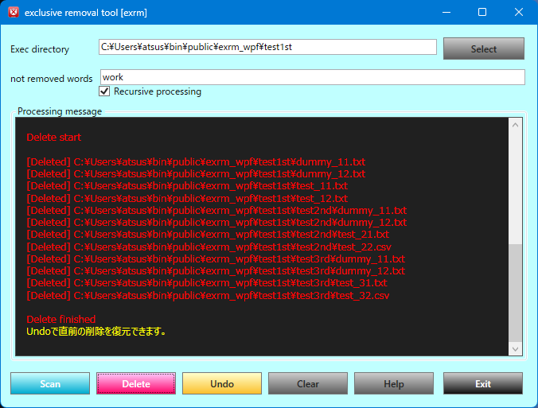
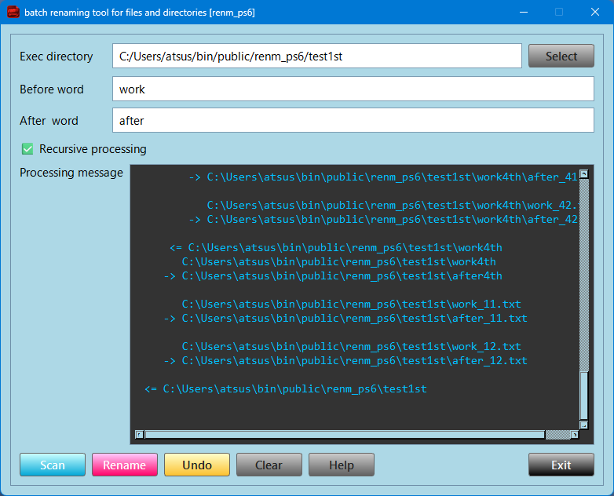
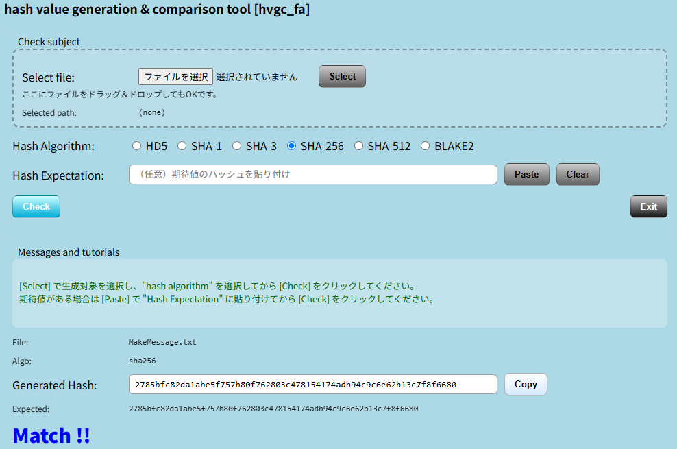
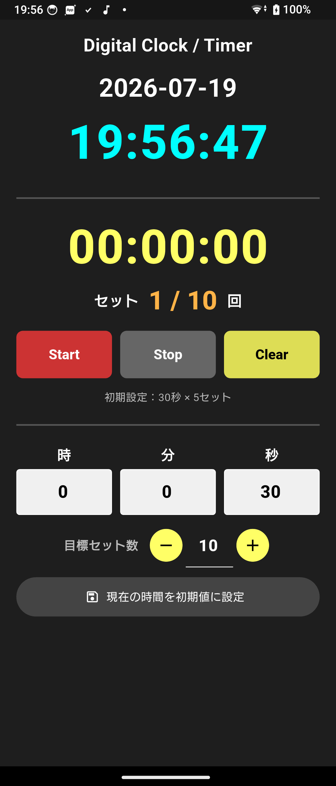
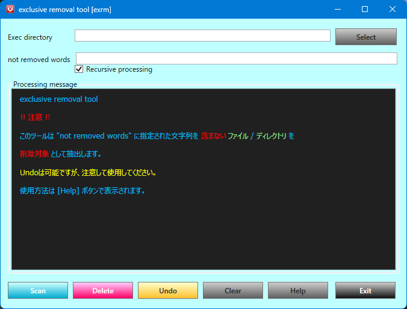
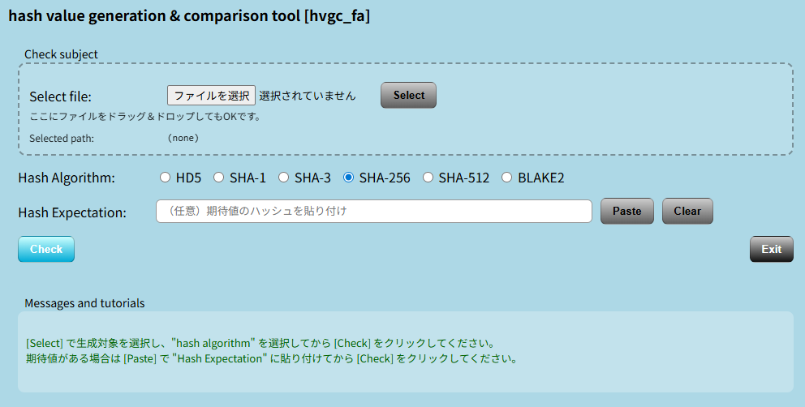
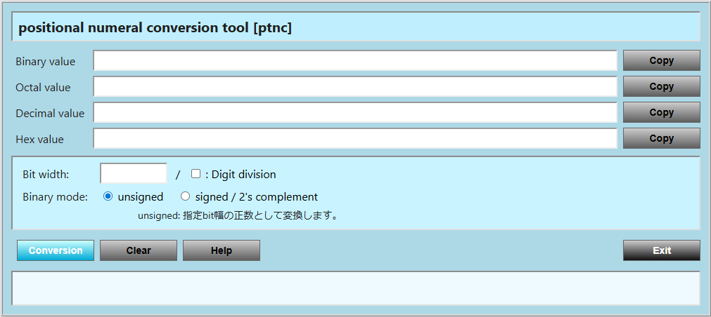
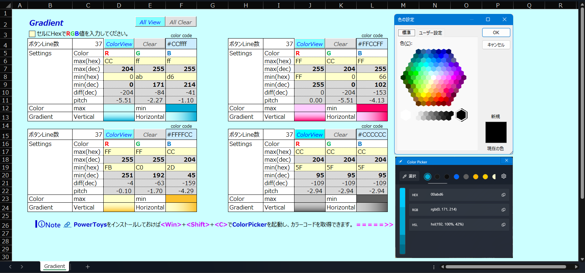

	
	

# Overview
## 業務効率化および運用改善を目的としたツール群。
ファイル操作や整合性検証といった反復作業を対象に開発しました。  
　* DeskTop ( アプリケーション [ **Windows** ] )　　( **C#** [ **WPF** ] / **Python** [ **PySide6** / **Tkinter** ] )  
　* Web　　( API / アプリケーション )　　　 　 　( **Python** [ **FastAPI** / **FLASK**] )  
　* Mobile　( アプリケーション [ **Android** / **iOS** ] ) ( **Dart** [**Flutter**] )  
単なる機能実装に留まらず、実運用を想定し、操作性・安全性・再現性を重視した設計としています。  
本ツール群では、複数フレームワーク間での**UI/UX**統一を意識して、ボタン色・操作体系・ログ表現を共通化しています。  
## Featured Tools

| exrm | renm | hvcg | tmct |
|:----:|:----:|:----:|:----:|
|  |  |  |  |  
| [条件付き削除](https://github.com/AHazeyama/public/tree/main/exrm_wpf) | [正規表現リネーム](https://github.com/AHazeyama/public/tree/main/renm_ps6) | [Checksum検証](https://github.com/AHazeyama/public/tree/main/hvcg_fa) | [リハビリ用タイマー](https://github.com/Ahazeyama/public/tree/main/tmct_flt) |

***
 

# Tool Description
| Item (Link) | Description | Platform | Preview |   
|:--|:--|:--:|:--:|  
| [exrm_wpf](https://github.com/AHazeyama/public/tree/main/exrm_wpf) | **C#** / **WPF** によるファイル操作ツール |  |  |  
| [renm_ps6](https://github.com/AHazeyama/public/tree/main/renm_ps6) | **Python** / **PySide6** によるファイル一括リネームツール |  | |  
| [renm_tk](https://github.com/AHazeyama/public/tree/main/renm_tk) | **Python** / **Tkinter** によるファイル一括リネームツール |  | |  
| [tmct_tk](https://github.com/AHazeyama/public/tree/main/tmct_tk) | **Python** / **Tkinter** によるタイマー&カウンター |  |  |
| [tmct_flt](https://github.com/AHazeyama/public/tree/main/tmct_flt) | **Flutter** によるタイマー&カウンター |  |  |
| [hvgc_fa](https://github.com/AHazeyama/public/tree/main/hvcg_fa) | **Python** / **FastAPI** による**Checksum** (Hash値) ツール | 🌐 | |  
| [ptnc_flask](https://github.com/AHazeyama/public/tree/main/ptnc_flask) | **Python** / **FLASK** による位取り記数法 (2,8,10,16進数) 変換ツール | 🌐 | |  
| Gradient | ツール群のGUI統一用グラディエント確認ツール **Excel**  (.xlsm)|  |  |

> [!NOTE]  
> 各画像をクリックして頂けると、拡大表示します。 

> [!WARNING]  
	
	

 

# Download the Release 
&emsp; 🔗 https://github.com/AHazeyama/public/releases/latest  

> [!NOTE]  
> 各ツールの軽量版として Tkinter 実装も公開しています。  

