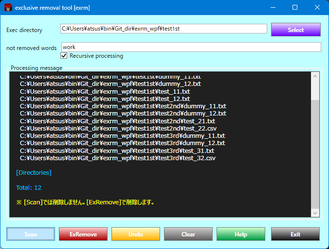
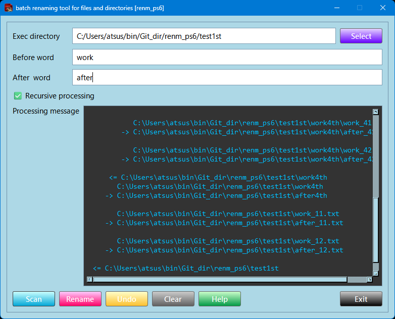
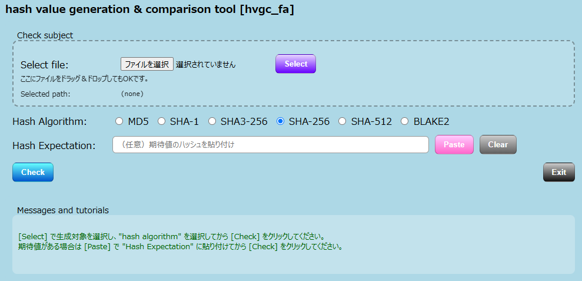
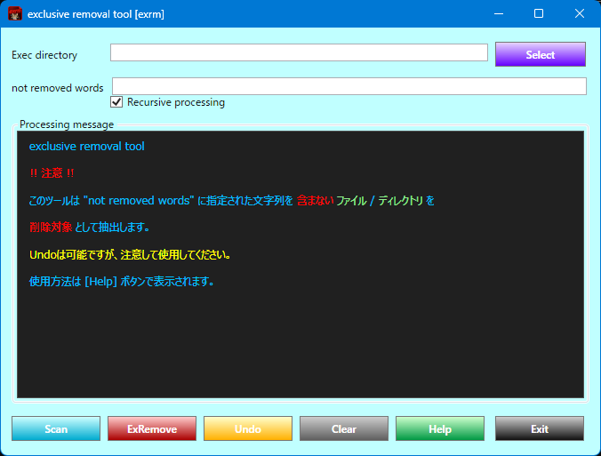
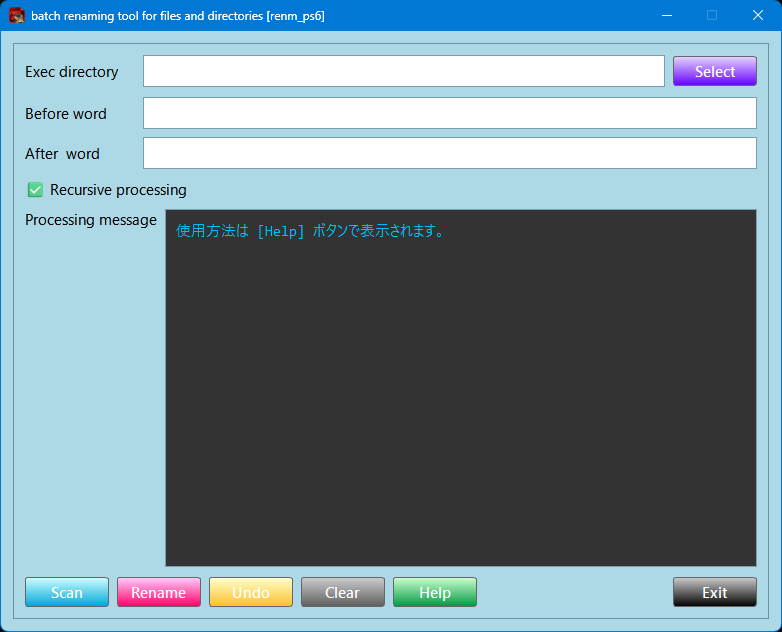
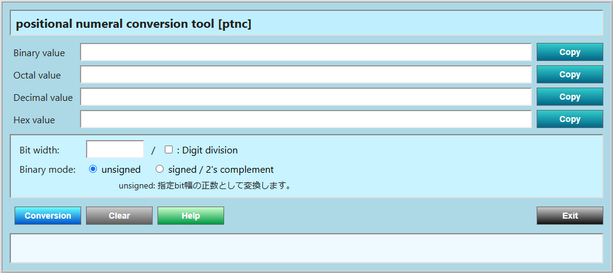
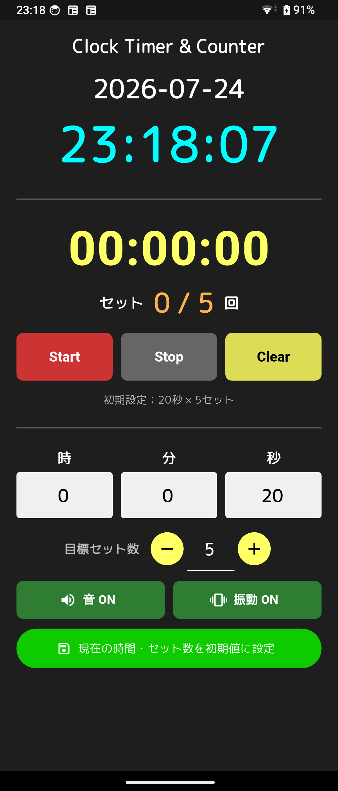
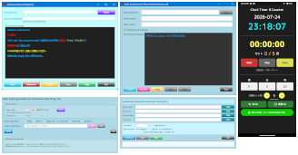
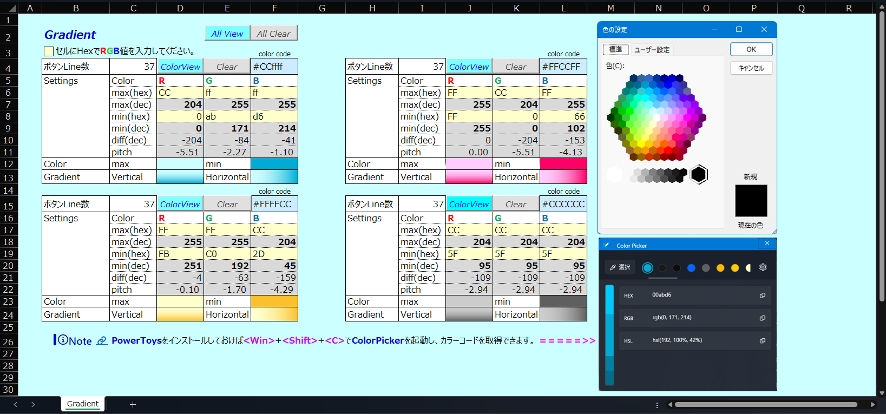
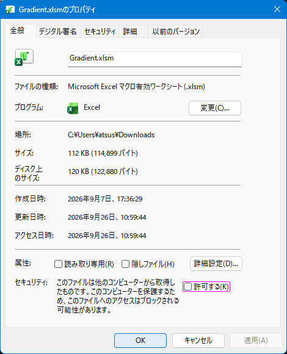

  
  
  

  

<!--  
  
-->  

# Overview  
## 業務効率化および運用改善を目的としたツール群。  
実務上の課題に対して作成したツールのうち、汎用化できるものを公開しています。  
ファイル操作や整合性検証といった反復作業補助が目的です。  
　* DeskTop ( アプリケーション [ **Windows** ] )　　 : ( **C#** [ **WPF** ]　**/**　**Python** [ **PySide6** / **Tkinter** ] )  
　* Web　　( API / アプリケーション )　　　　　　: ( **Python** [ **FastAPI** / **FLASK**] )  
　* Mobile　( アプリケーション [ **Android** / **iOS** ] ) : ( **Dart** [**Flutter**] )  

単なる機能実装に留まらず、実運用を想定し、操作性・安全性・再現性を重視した設計としています。  
本ツール群では、複数フレームワーク間での**UI/UX**統一を意識して、ボタン色・操作体系・ログ表現を共通化しています。  
## Featured Tools  

| exrm | renm | hvgc | tmct |  
|:----:|:----:|:----:|:---------------------------------:|  
|  |  |  |  |  
| [条件付き削除](https://github.com/AHazeyama/exrm_wpf) | [正規表現リネーム](https://github.com/AHazeyama/renm_ps6) | [Checksum検証](https://github.com/AHazeyama/hvgc_fa) | [<nobr>リハビリテーション支援</nobr> <nobr>タイマー & カウンター</nobr>](https://github.com/AHazeyama/tmct_flt) |  
***  
   

# Tool Description  
| Item  | Description | Platform | Preview |   
|:--|:--|:--:|:--:|  
| [exrm_wpf](https://github.com/AHazeyama/exrm_wpf) | **C#** [ **WPF** ] によるファイル操作ツール |  |  
| [renm_ps6](https://github.com/AHazeyama/renm_ps6) | **Python** [ **PySide6** ] によるファイル一括リネームツール |  |  |  
| [hvgc_fa](https://github.com/AHazeyama/hvgc_fa) | **Python** [ **FastAPI** ] による**Checksum** (Hash値) ツール |  |  |
| [ptnc_flask](https://github.com/AHazeyama/ptnc_flask) | **Python** [ **FLASK** ] による位取り記数法 (2,8,10,16進数) 変換ツール |  | |  
| [tmct_flt](https://github.com/AHazeyama/tmct_flt) | **Dart** [ **Flutter** ] によるカウントダウンタイマー&カウンター | |  |  
| [Tkinter tools](https://github.com/AHazeyama/Tkinter_tools) | **Python** [ **Tkinter** ] によるツール群 上記 ( exrm, renm, hvgc, ptnc, tmct )  |  |  |  
| [Perl tools](https://github.com/AHazeyama/Perl_tools) | **Perl** による CLI ツール群  　( Perl版を元に言語展開して各ツールを作成しています ) |  |  |  
| Gradient | **Excel** (.xlsm) ツール群のGUI統一用グラディエント確認ツール |  |  |  

  

> [!NOTE]  
> ｢Tool Description **/** Item｣ のアプリ名は詳細ページへリンクしています。  
> Preview画像をクリックして頂けると、拡大表示します。  
  
> [!WARNING]  
> 　Excel (.xlsm) にはマクロが含まれています。  
> 　実行許可 :  右 　     　      
>  : ファイル　　 : マウスクリック　　 : 次に行う動作  

## Download the Release 
　[ Download Repository (GitHub)](https://github.com/AHazeyama/public/releases/latest)

> [!NOTE]  
> 各ツールの軽量版として Tkinter 実装も公開しています。  

## License  
　TBD  