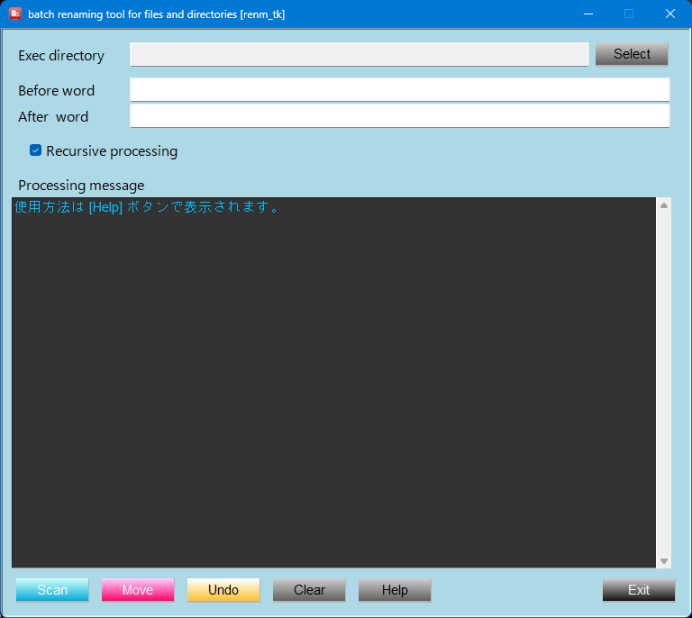

<p align="left">
  
  
</p>

# batch renaming tool for files and directories [renm_tk]
<p align="left">
  
</p>

## Overview
　大量ファイルのリネーム作業を安全かつ効率的に行うためのデスクトップGUIツールです。

## Purpose
* 手作業によるリネーム作業の効率化
* 操作ミスの削減
* 大量ファイル処理の自動化

## Features
* ファイル / ディレクトリの一括リネーム
* 正規表現対応（柔軟なパターン変換）
* サブディレクトリを含めた再帰処理
* 処理内容のリアルタイム表示
* Undoによる安全な復元
* 標準ライブラリによる軽量アプリケーション(**Tkinter**)
* 単体exeで実行可能（Windows）
* Windows / Linux でのCLI実行

## Usage
1. ｢**Select**｣ をクリックし、**Exec directory** を選択
2. **Before word** に変換前文字列（正規表現可）を入力
3. **After word** に変換後文字列を入力
4. ｢**Scan**｣ をクリックし、**Processing message** に表示される内容を確認
5. ｢**Rename**｣ をクリックして実行
6. 必要に応じて ｢**Undo**｣ で元に戻す

## Use Case
- 自動で生成されたファイル名(日付+追番等)の一括リネーム
- Prefix、Suffix等の文字列の付加
- ファイル名中の不要文字列の削除

## Caution
　本ツールはファイル / ディレクトリ構成を変更します。  
　誤操作により意図しない結果になる可能性があります。  
　そのため、以下の対策を実装しています
* 処理内容の可視化（ログ表示）
* バックアップ生成（.bk）
* Undoによる復元機能

## UI Components
### Input items
>| Item | Description |
>| :--| :--|
>| Exec directory         | 処理対象ディレクトリ         |
>| Before word            | 変換対象文字列 (正規表現対応) |
>| After word             | 変換後文字列                |
>| ☑ Recursive processing | サブディレクトリを再帰処理   |
>| Processing message     | 処理ログ表示                |
### Buttons
>| Item | Description |
>| :--| :--|
>| Move  | 変換実行       |
>| Clear | 入力クリア     |
>| Undo  | 変更の取り消し |
>| Help  | ヘルプ表示     |
>| Exit  | 終了          |

## Tech Stack
* Python 3.x
* Tkinter

## Design / Implementation Points
- 一括リネーム、文字列追加/削除に特化
- GUI から扱えるようにして、CLI に不慣れな利用者でも操作可能
- Undo を実装し、操作リスクの軽減を意識
- 処理メッセージ表示により、何が起きているかを分かりやすく可視化

## Why Tkinter
　本ツールはPython標準ライブラリのみの構成と動作の軽快性を重視し、Tkinter を採用しています。
- 動作の軽快感
- 外部ライブラリ不使用による実装の容易化
- 状態表示やメッセージ表示を組み込みやすい
- デスクトップユーティリティに適した構成

## Build (for developers) 
　  
```pwsh
pyinstaller `  
  --noconsole `  
  --onefile `  
  --icon=renm_tk.ico `  
  --add-data "renm_tk.ico;." `  
  --version-file=renm_tk.version `  
  renm_tk.py  
```  

## Documentation  
　**Doxygen** により生成できます。  
　⇒ ソースコードの可読性向上と構造理解を目的としています。  
　  
　```
doxygen Doxyfile
　```  
　生成後、以下のファイルをブラウザで開くことでドキュメントを確認できます。  
　```  
🗁 docs/html/index.html  
　```

## Download
　🔗 https://github.com/AHazeyama/public/releases/latest  

## License
　TBD
