<p align="left">  
	  
	  
</p>  
  
# OverView  
#### 目的 : リハビリテーション(姿勢保持動作)支援アプリケーションの作成<br>　　　OS不問のMobileアプリケーション開発<br> 内容 : **Android** / **iOS** 両用開発環境を構築し、アプリケーション開発を行う  
|Item|Content|  
|:--|:--|  
|OS||  
|言語||  
|FrameWork||  
|IDE||  
|Editor|　　|  
|検証機材||  
  
　※ 記号例  
```  
　🪟:デスクトップ、⬇️:マウスクリック、 [･･･]:ボタン、<･･･>:Press the Key、⇒:次動作、#･･･:コメント  
　"･･･":テキスト、a/b:選択(a or b)、｢･･･｣:ウィンドウ/メニュー/フォーム、  
```  

# リハビリテーション用タイマー&カウンター[tmct]開発手順  

> [!NOTE]
> 各画像は⬇️で拡大します。
## インストール														<!-- 01 -->
　既に現環が存在する場合は末尾の ｢**現環境削除**｣ 項参照  
### 環境確認														<!-- 02 -->
　  

　```
　git --version <⏎>  
　```  
　　  
　```  
　code --version <⏎>  
　```  
　　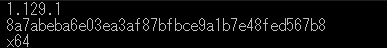  

## Flutter インストール												<!-- 03 -->
　　👇ボタンより FlutterSDK バンドルをダウンロード  
　　[](https://storage.googleapis.com/flutter_infra_release/releases/stable/windows/flutter_windows_3.44.8-stable.zip)  🔗[Install Flutter manually](https://docs.flutter.dev/install/manual)  
　解凍して任意のフォルダへ保存　　推奨：🗁 C:\Develop\  

## 環境変数登録														<!-- 04 -->
　画面左下の  へ"環境変数"を入力して 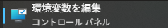 を⬇️  
　｢･･･のユーザー環境変数(<u>U</u>)｣ ⇒ ｢Path｣ ⇒ [編集(<u>E</u>)…] ⇒ ｢環境変数名の編集｣/[新規] ⇒ 追加 "C:\Develop\flutter\bin"  
　　　[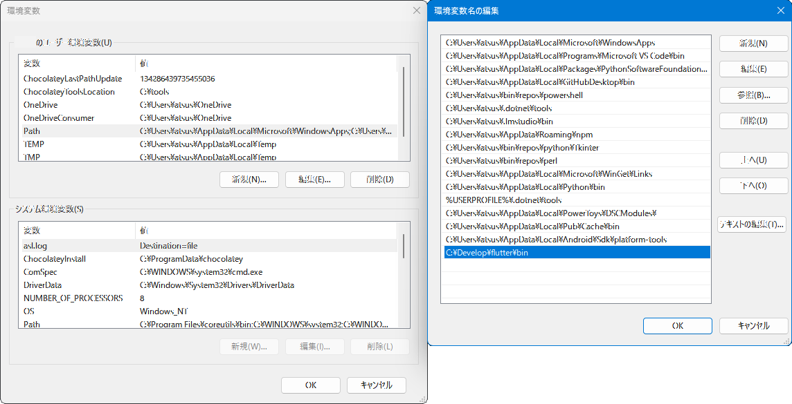](./assets/prtsc/04-03_control-panel.png)  

## Flutter パス確認													<!-- 05 -->
　  
　```
　flutter --verison <⏎>
　```  
　　[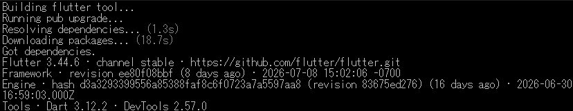](./assets/prtsc/05-01_flutter-version.png)  
　```
　dart --verison <⏎>
　```  
　　[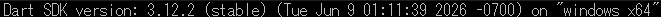](./assets/prtsc/05-02_dart-version.png)  
  
## VS Code への機能拡張追加											<!-- 06 -->
　  
　左ツールバーの 
⬇️ 、又は ⚙️⬇️ ⇒ [機能拡張　Ctrl+Shift+X]⬇️ ⇒  

　[](./assets/prtsc/06-01_VSC-flutter-ext.png)　**/**　[](./assets/prtsc/06-02_VSC-dart-ext.png)  

## Flutter初回診断													<!-- 07 -->
　  
　```
　flutter doctor -v <⏎>  
　```  
　　　[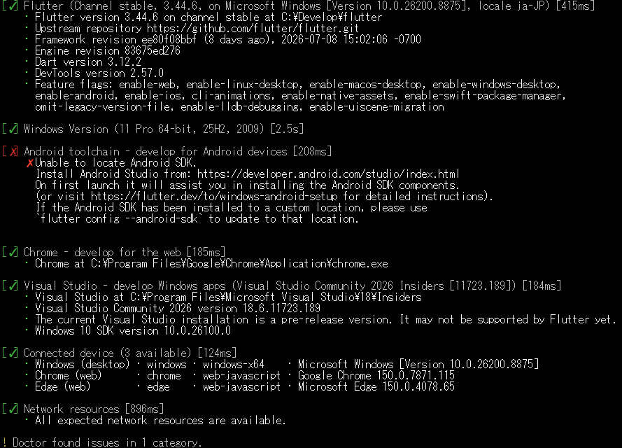](./assets/prtsc/07-01_flutter-doctor.png)  
> [!IMPORTANT]  
> この時点ではAndroidにエラーが出ていても問題無し  
> Flutterがインストールされていれば **OK**  
  
## AndroidStudio インストール										<!-- 08 -->
　  
　インストーラ入手  
　　🔗[Android Studio](https://developer.android.com/studio?hl=ja)　※使用許諾の必要があるため、リンク先の  よりダウンロード  
　　 W⬇️  
　　デフォルト設定でインストール  
　　SDKインストール先 : 🗁 C:\Users\ユーザー名\AppData\Local\Android\Sdk  
　　🔗[インストール方法詳細](./AS_Introdunction.md)  


### Project 作成													<!-- 09 -->
|Welcome to<br>Android Studio|Trust and Open<br>Project|  
|:---:|:---:|  
|[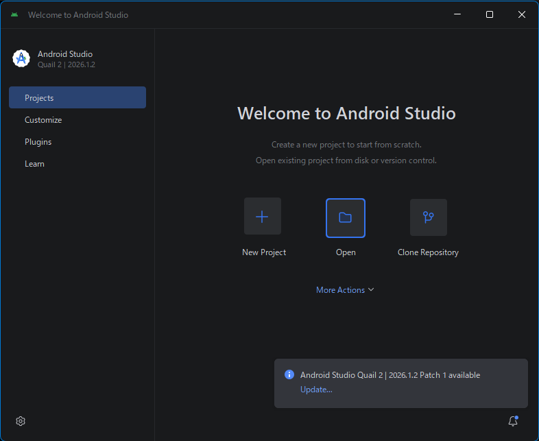](./assets/prtsc/09-01_welcomeAS.png) |[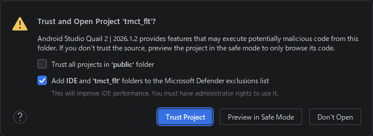](./assets/prtsc/09-02_trust-and-openproject.png)|  
|｢Open｣ ⬇️| ⬇️|

> [!IMPORTANT]
> **tmct_flt** は **main.dart** 及び **pubspec.yaml** を別途作成し、AndroidStudioに読み込ませています。

### SDK インストール												<!-- 10 -->
　  
　　[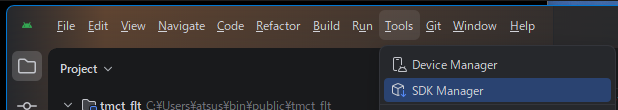](./assets/prtsc/06-05_menu-bar-SDKmaneger.png)  
　Menu ｢｣ ⬇️ ⇒ ｢Tools」 ⇒ 「SDK manager」⬇️ ⇒  SDKインストール   

#### 設定内容  
|Item|Content|Remarks|  
|:---|:---|:---|  
|SDK Platforms|Android 16.0 ("Baklava")|Emulator用なので、一般的なSDKで|
|SDK Tools|Android SDK Build-Tools<br>　　37.0.0<br>　　36.1.0<br>　　36.0.0<br>Android Eulator<br>Android SDK Platform-Tools|<br>┐<br>┼─　｢  ｣ で表示<br>┘<br> <br> <br>|  

　　🔗[SDKインストール方法詳細](./AS_SDK-Introduction.md)  

> [!IMPORTANT]
> 項目の左に []️ がある場合は、先にクリックしてインストールすること。  

### Device 設定														<!-- 11 -->
　  
　　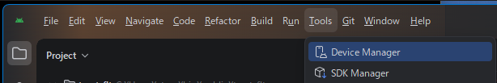  
　Menu ｢️｣⬇️ ⇒ ｢Tools」 ⇒ 「SDK manager」⬇️ ⇒  スマートフォンイメージ インストール   

#### 設定内容  
|Item|Content|Remarks|  
|:---|:---|:---|  
|name|Pixcel 7||
|API|API 36.1 "Baklava";Andoid16||
|Services|Google Play Store||
|System Image|16KB Page Size Google Play Intel x86 64 Atom System Image||

　　🔗[Device設定方法詳細](./AS_Device-Introduction.md)  
> [!IMPORTANT]
> 項目の左に []️ がある場合は、先にクリックしてインストールすること。  


### Android ライセンス承認											<!-- 12 -->
　  
　```
　flutter doctor --android-licenses <⏎>  
　```  

　以降、何度か"Accept? (y/N)"と聞かれるので、全て\<y\>で **OK**  

<br>

　  
　上記メッセージを確認できれば承認完了。
  
### Emulator 起動													<!-- 13 -->
　  
　Menu ｢️｣⬇️ ⇒ ｢Tools」 ⇒ ｢Device Manager｣⬇️ ⇒  
　　  

　｢Device Manager｣⬇️ ⇒ ｢**＋**｣⬇️ ⇒ ｢Create Virtual Device｣⬇️  
　　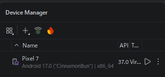 
 
 
  
　　[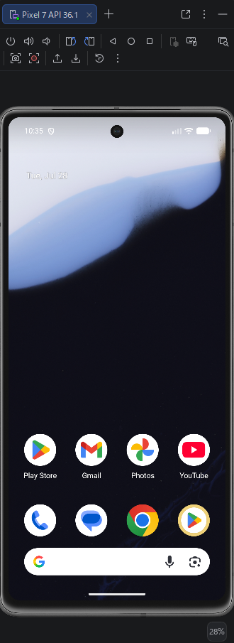](./assets/prtsc/03-07_Emulator-Pixcel7-1st.png)  

<br>

## tmct_flt 作成													<!-- 14 -->
> [!NOTE]  
> コマンドは全て   
> Emulator が起動した状態で実施  
### 開発環境確認													<!-- 15 -->
　```
　flutter doctor -v <⏎>  
　```  
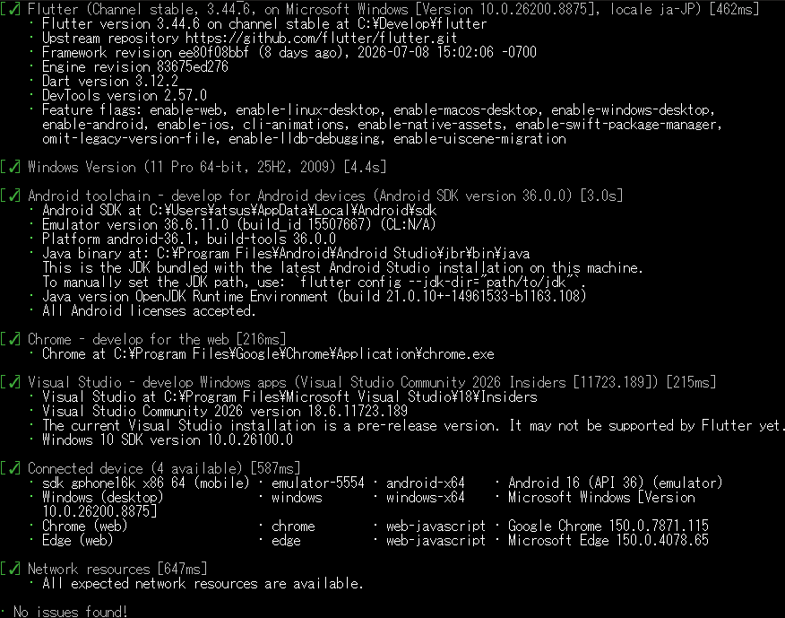  

<br>

　```
　flutter devices <⏎>  
　```  
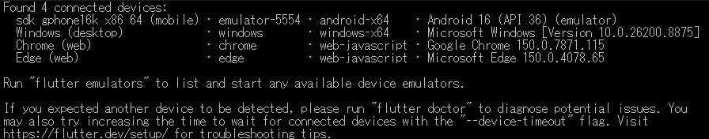  

### Android フォルダ生成											<!-- 16 -->
> [!TIP]
> .dart、.yaml、.xmlのバックアップをお勧めします。  
> 　```  
> tree /f ./tmct_flt <⏎>
> 　```  
> 　　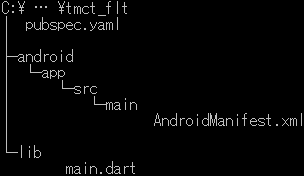  

　```
　flutter create --platforms=android --project-name tmct_flt . <⏎>
　```
　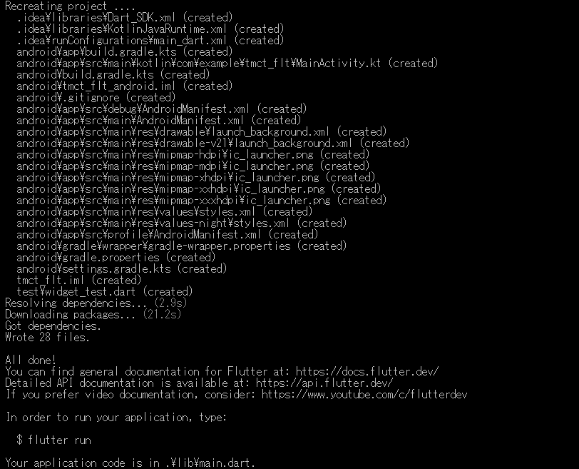  

### パッケージ取得													<!-- 17 -->
　```
　flutter pub get <⏎>
　```  
　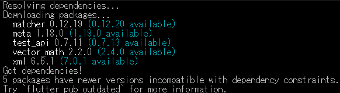  

### アイコン生成													<!-- 18 -->
　🔗アイコン生成手順(TBD)  
#### アイコン付加手順
　```
　flutter pub add --dev flutter_luncher_icons <⏎>
　```  
　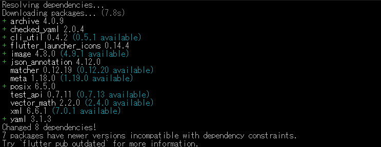  

　```
　dart run flutter_launcher_icons <⏎>
　```  
　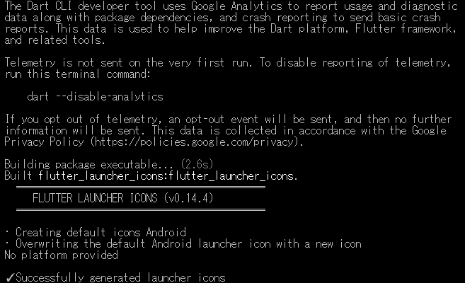  

> [!IMPORTANT]
> エラー発生時は "🗋 pubspec.yaml" を確認
> iosが "ios: **true**" になっていれば変更 ⇒ "ios: **false**"　# 現状Android版のみのため  
> 　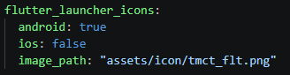  

　```  
　flutter analyze <⏎>
　```  
　  

> [!IMPORTANT]
> 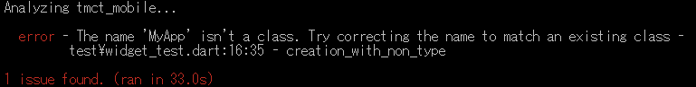  
> エラー発生時は "🗁 test" を削除  

　```
　flutter devices <⏎>  
　```
　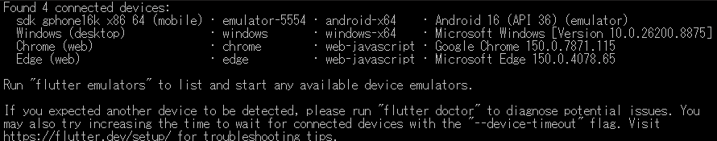  

### Emulatorで実行  												<!-- 19 -->
　"flutter devices"で確認したデバイスIDを指定する事。  
　```
　flutter run -d emulator-5554 <⏎>  
　```  
　　[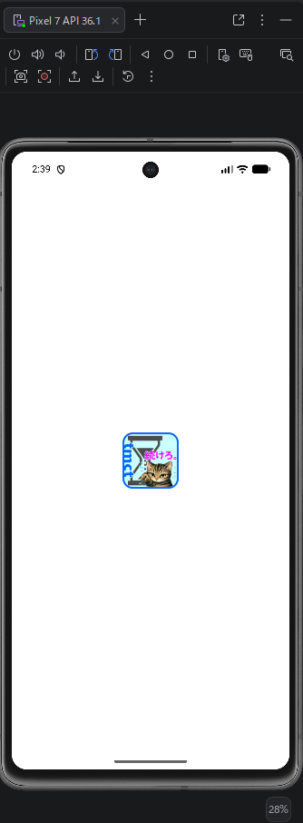](./assets/prtsc/19-01_emulation-install.png)
　
　[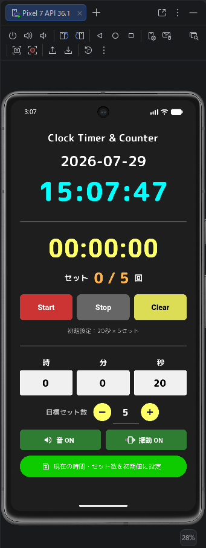](./assets/prtsc/19-02_emulation-tmct_flt.png)
　
　[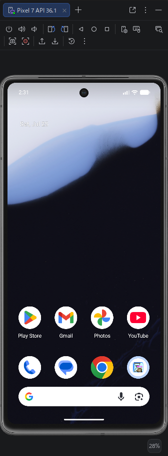](./assets/prtsc/19-03_emulation-home.png)
> [!TIP]
> 基本的な動作確認を行っておきます

<br>

## 配布版作成														<!-- 20 -->
　  
　```  
　flutter clean <⏎>  
　```  
　```  
　flutter pub get <⏎>  
　```  
　　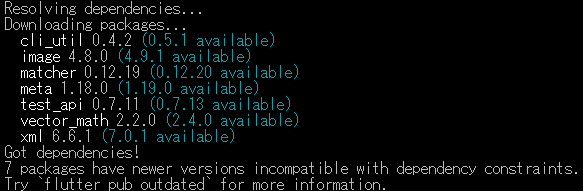  

　```  
　flutter build apk --release <⏎>  
　```  
　　[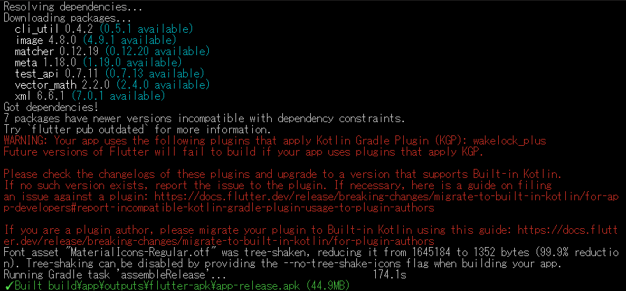](./assets/prtsc/20-02_flutter-build-apk.png)  
　出力フォルダ : 🗁 .\build\app\outputs\app-release.apk
　配布時は 🗋 tmct-flt.apk にリネーム


## 実機検証															<!-- 21 -->
### 接続															<!-- 22 -->
　開発PCとスマートフォンをUSBケーブルで接続 ⇒  確認  
### USBデバッグモード On											<!-- 23 -->
　  
　｢⚙️｣ ⇒ ｢システム｣ ⇒ ｢開発者向けオプション｣ ⇒  ⇒ ｢USBデバッグを許可しますか？｣ ⇒ [**OK**]  

### tmct_flt インストール											<!-- 24 -->
　  
　```
　flutter devices <⏎>  
　```  
　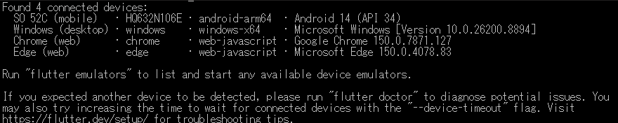  

　```
　flutter run <⏎>  
　```  
　[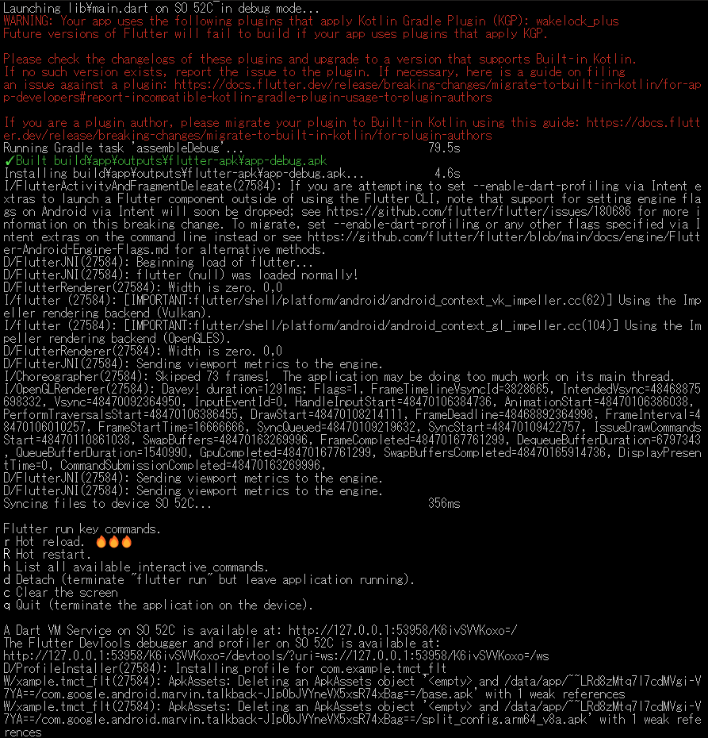](./assets/prtsc/24-02_flutter-run.png)  

　HOMEに移動  
　[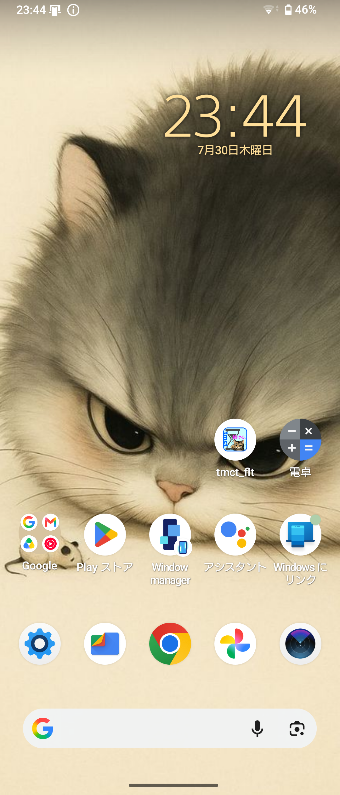](./assets/EXPERIA10IV_tmct_flt.png)  

### デバッグ														<!-- 25 -->
　実行　[](./assets/env/M_Android-tmct-icon.png) タップ
　
　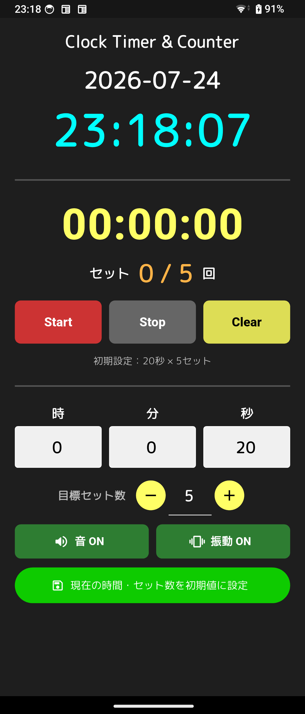

#### Input items
>| Item | Description |
>| :--| :--|
>| YYYY-MM-DD| 現在日付 |
>| HH:MM:SS | 現在時刻 |
>| HH:MM:SS | タイマー時間 |
>| セット | 繰り返し回数 |
#### Buttons
>| Item | Description |
>| :--| :--|
>| Start | カウントダウン開始 |
>| Stop | カウントダウン停止 |
>| Clear | 時間、回数リセット |
>| 時 | タイマー時 設定 |
>| 分 | タイマー分 設定 |
>| 秒 | タイマー秒 設定 |
>| 目標セット数 | タイマー実行回数 |
>| 現在の時間･セット数を初期値に設定 | 指定した時間とセット数を初期値に設定 |

#### デバッグ項目  
|分類|項目|操作|期待値|判定|備考|
|:---|:---|:---|:---|:---|:---|
|正常系||||||
|異常系||||||
|境界値||||||
|デグレード||||||
|エージング||||||
　🔗テスト仕様書(TBD)

## 公開準備															<!-- 26 -->
### Sourceコード整備
　コメント整備

### Version設定
　フォーマット : v0.00.0+1 (v **X1** . **X2** . **X3** +**X4**)  
|位置|項目|内容|備考|
|:---|:---|:---|:---|
|X1|メジャーバージョン|主要機能追加||
|X2|マイナーバージョン|機能追加|改良、UI変更等|
|X3|カウンターメジャー|不良対策履歴|外部公開不良等|
|X4|ビルド|内部更新|内部変更、デバッグ等|

### ドキュメント整備
　README、要件定義、機能仕様、詳細仕様、検査仕様
> [!NOTE]
> 公開範囲は個別判断

### GitHub登録内容定義
　リポジトリ構成、.gitignore等
