<p akugb=:keft>
	
	
</p>

# 開発ツールインストール											<!-- 01 -->  
　**SDK(Flutter)** 及び **IDE(Android Studio)** のインストールと環境設定を行います。

> [!NOTE]  
> ※ 凡例  
> 　 デスクトップ、️：マウスクリック、 ：ボタン、：Press the Key、：Enter key press、  
> 　：テキスト、**a** / **b**：選択(**a** or **b**)、：ウィンドウ/メニュー/フォーム、⇒：次動作、：コメント、  
>　：ターミナル、：クリックでText表示 (コピー可能)  

> [!NOTE]  
> 縮小表示されている画像は  で拡大されます (マウスカーソルが  になる画像が縮小表示画像です)。  
>  本章のコマンドは全て　 　にて実行しています。  

## インストール済みツール確認										<!-- 01-01 -->
<details>   
<summary>
  

&nbsp;  
</summary>  
  
```  
git --version
```  
</details>  
　  
<details>   
<summary>
  

&nbsp;  
</summary>  
  
```  
code --version
```  
</details>  
　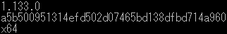  

## Flutter(Framework) & Dart(Language) インストール				<!-- 01-02 -->
　👇ボタンより FlutterSDK バンドルをダウンロード  
　[](https://storage.googleapis.com/flutter_infra_release/releases/stable/windows/flutter_windows_3.44.8-stable.zip)   [Install Flutter manually](https://docs.flutter.dev/install/manual)  
　解凍して任意のフォルダへ保存　　推奨：🗁 C : \ Develop \  

## 環境変数登録													<!-- 01-03 -->
### インストール&Path確認
　 左下の  へ"環境変数"を入力して [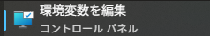](./assets/env/M_env-val-icon.png) を   

　｢･･･のユーザー環境変数(<u>U</u>)｣ ⇒ ｢Path｣ ⇒ [編集(<u>E</u>)…] ⇒ ｢環境変数名の編集｣/[新規] ⇒ 追加 "C:\Develop\flutter\bin"  
　[](./assets/prtsc/M_WIN_01_Env-val-cntl.png)

<details>   								<!-- Segment row count: 11 rows -->
<summary>
  

&nbsp;  
</summary>  
  
```  
flutter --version
```  
</details>  

　[](./assets/prtsc/M_ER_01_flutter-version.png)  

<details>   								<!-- Segment row count: 11 rows -->
<summary>
  

&nbsp;  
</summary>  
  
```  
dart --version
```  
</details>  

　[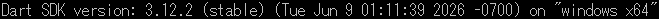](./assets/prtsc/M_ER_01_dart-version.png)  

### VS Code への機能拡張追加
　左ツールバーの 

️ 、 又は
️️
 ⇒ 
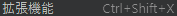️
 ⇒  
　　**/**　
　インストール  

### Flutter初回診断
<details>   								<!-- Segment row count: 11 rows -->
<summary>
  
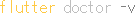
&nbsp;  
</summary>  
  
```  
flutter doctor -v
```  
</details>  

　[](./assets/prtsc/M_ER_01_flutter-doctor-v-error.png)

> [!IMPORTANT]
> この時点では Android Studio / cmdline-tools がインストールされていないため、にエラーが出る。
> Flutterがインストールされていれば **OK**

## Android Studio(IDE) インストール									<!-- 01-04 -->
　
### インストーラ入手  
　 [Android Studio](https://developer.android.com/studio?hl=ja)　※使用許諾の必要があるため、リンク先の  よりダウンロード  
　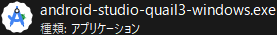 W️ 
　　　　    
　　SDKインストール先 :  C:\Users\ユーザー名\AppData\Local\Android\Sdk
### プロジェクト作成
|Welcome to<br>Android Studio|Trust and Open<br>Project|
|:---:|:---:|
|[](./assets/prtsc/01-04-01_welcomeAS.png) |[](./assets/prtsc/01-04-02_trust-and-openproject.png)|
|｢Open｣ | |

> [!IMPORTANT]
> **tmct_flt** は **main.dart** 及び **pubspec.yaml** を別途作成し、Android Studioに読み込ませています。

### SDK インストール
　  
　[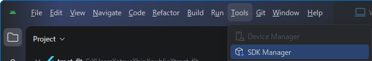](./assets/env/M_as_menu-bar-SDK_Maneger.png)  
　Menu ｢ 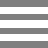 ｣ 
 ⇒ ｢Tools」 ⇒ 「SDK Manager」
 ⇒  SDKインストール  

|Item|Content|Remarks|
|:---|:---|:---|
|SDK Platforms|Android 16.0 ("Baklava")|Emulator用なので、一般的なSDKで|
|SDK Tools|Android SDK Build-Tools<br>　　37.0.0<br>　　36.1.0<br>　　36.0.0<br>Android Emulator<br>Android SDK Platform-Tools|<br>┐<br>┼─　｢  ｣ で表示<br>┘<br> <br> <br>|

　 [SDKインストール方法詳細](./SDK-Introduction.md)

> [!IMPORTANT]
> 項目の左に [  ]️ がある場合は、先にクリックしてインストールすること。

### Emulator(Pixel7)インストール
　  
　Menu ｢ ️ ｣
  ⇒ ｢Tools」 ⇒ 「SDK Manager」
  ⇒  スマートフォンイメージ インストール   
　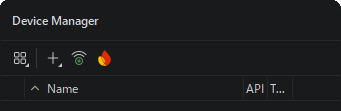

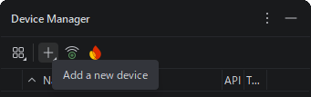


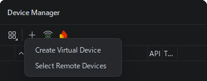


#### 設定内容
|Item|Content|Remarks|
|:---|:---|:---|
|name|Pixel 7||
|API|API 36.1 "Baklava";Android 16||
|Services|Google Play Store||
|System Image|16KB Page Size Google Play Intel x86 64 Atom System Image||

　 [Device設定方法詳細](./Device-Introduction.md)
> [!IMPORTANT]
> 　項目の左に  がある場合は、先にクリックしてインストールすること。

### Android ライセンス承認
<details>   								<!-- Segment row count: 11 rows -->
<summary>
  

&nbsp;  
</summary>  
  
```  
flutter doctor --android-licenses
```  
</details>  

　[](./assets/prtsc/M_AS_01_flutter-doctor-LicenseApproval.png)  
　以降、何度か"Accept? (y/N)"と聞かれるので、全て\<y\>で **OK**  

　  
　上記メッセージを確認できれば承認完了。

### 完了確認
　次の状態になっていれば、開発環境の構築は完了です。
- `flutter doctor -v` でFlutter及びAndroid toolchainが認識される
- Androidライセンスが承認済み
- Android Studioから Pixel7 Emulatorを起動できる
- VS CodeでFlutter及びDart拡張機能が有効になっている

## Emulator起動														<!-- 01-05 -->
　  
　Menu ｢ ️ ｣
️ ⇒ ｢Tools」 ⇒ ｢Device Manager｣
️ ⇒  
　  

　｢Device Manager｣
️  　　　　　｢**＋**｣
️  　　　　　　　　　　　 ｢Create Virtual Device｣
️  
　 
　 
　
　 
　[](./assets/prtsc/M_AS_01_Emulator-Pixel7-1st.png)
