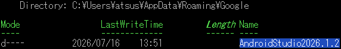
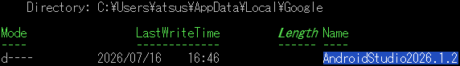
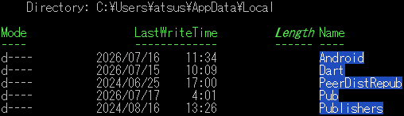

<p akugb=:keft>  
	  
	  
</p>  

# 開発環境初期化
　インストール済みの **Flutter** と **Android Studio**  及びその環境、生成物の削除を行います。  

> [!NOTE]  
> 縮小表示されている画像は⬇️で拡大されます。  
> 
> ```pwsh  
> ※ 記号例  
> 　🪟:デスクトップ、⬇️:マウスクリック、 [･･･]:ボタン、<･･･>:Press the Key、⇒:次動作、#･･･:コメント  
> 　"･･･":テキスト、a/b:選択(a or b)、｢･･･｣:ウィンドウ/メニュー/フォーム、  
> ```  
  
## 環境確認
### 　Flutter SDK 環境  
　この章のコマンドは全て にて実行 。　※<⏎> : Enter key press  
　現在の開発環境確認  

　Path確認  
```pwsh  
　where.exe flutter <⏎>  
```  
　　  
  
　Flutter確認  
```pwsh  
　flutter doctor -v <⏎>  
```  
　　[](./assets/prtsc/01-02_flutter-doctor.png)  

### 　Android 環境  
```pwsh  
　Get-ChildItem Env: |  
　    Where-Object {  
　        $_.Name -match 'ANDROID|JAVA|FLUTTER|DART|GRADLE|PUB'  
　    } |  
　    Sort-Object Name <⏎>  
```  
　　  
  
　Path確認  
```pwsh  
$env:Path -split ';' |  
    Where-Object {  
        $_ -match 'flutter|android|dart|gradle|java'  
    } <⏎>  
```  
　　  
  
## 環境削除																<!-- 01-02 -->  
## Android Studio 削除  
　EmuratorはAndroidStudioから削除  
　残骸が残っていたら削除 : %USERPROFILE%\.android\avd  
　🖥️左下｢ ️  ]⬇️ ⇒ ｢  ｣右⬇️ ⇒ ｢  ｣ ⇒  
　｢⚙️Window｣ ⇒ ｢　　｣⬇️ ⇒ 「アンインストール」

## Android Studio 削除 確認  
```pwsh
　Test-Path "C:\Program Files\Android\Android Studio" <⏎>
　true
　Remove-Item -Recurse -Force "C:\Program Files\Android\Android Studio" <⏎>
```
## Android SDK 環境  
```pwsh
　Remove-Item -Recurse -Force "$env:LOCALAPPDATA\Android\Sdk" <⏎>
```
## $HOMEの環境 削除
```pwsh
　Remove-Item -Recurse -Force "$env:USERPROFILE\.android" <⏎>
```
## 設定 及び キャッシュ 削除  
### 環境変数
```pwsh
　Get-ChildItem "$env:LOCALAPPDATA\Google" -Directory -Filter "AndroidStudio*" <⏎>
```
　　
```pwsh
　Get-ChildItem "$env:LOCALAPPDATA\Google" -Directory -Filter "AndroidStudio*" |
　　Remove-Item -Recurse -Force <⏎>
　Get-ChildItem "$env:APPDATA\Google" -Directory -Filter "AndroidStudio*" |
　　-ErrorAction SilentlyContinue <⏎>
```
　　
```pwsh
　Get-ChildItem "$env:APPDATA\Google" -Directory -Filter "AndroidStudio*" | 
 　　-ErrorAction SilentlyContinue Remove-Item -Recurse -Force <⏎>
```

### Gladleキャッシュ 削除  
```pwsh
　Remove-Item -Recurse -Force "$env:USERPROFILE\.gradle" <⏎>
```

### Flutter SDK 削除  
```pwsh
　where.exe flutter <⏎>
```
　
```pwsh
　Remove-Item -Recurse -Force "C:\Develop\flutter" <⏎>
```

### Flutter & Dart 設定･キャッシュ 削除  
```pwsh
　$dartPaths = @(
    "$env:APPDATA\.dart",
    "$env:APPDATA\.dart-tool",
    "$env:LOCALAPPDATA\.dartServer"
　)

　foreach ($path in $dartPaths) {
    if (Test-Path $path) {
        Remove-Item -Recurse -Force $path
    }
　} <⏎>　# ⚠️<⏎>前までコピーして実行
```
```pwsh
　Remove-Item -Recurse -Force "$env:LOCALAPPDATA\Pub\Cache" -ErrorAction SilentlyContinue <⏎>
```

### プロジェクト内のBhild生成物 削除  
```pwsh
　flutter clean <⏎>
```
　

　🗁 : " **C:\Development\flutter** " を削除

## 再起動 ⇒  削除確認                                                   <!-- 01-03 -->  
```pwsh
　Get-ChildItem "$env:USERPROFILE" -Force -Directory |
    Where-Object {
        $_.Name -match 'android|flutter|dart|gradle'
    } <⏎>

　Get-ChildItem "$env:LOCALAPPDATA" -Force -Directory |
    Where-Object {
        $_.Name -match 'android|flutter|dart|gradle|pub'
    } <⏎>
```
　
```pwsh
　Get-ChildItem "$env:APPDATA" -Force -Directory |
    Where-Object {
        $_.Name -match 'android|flutter|dart|gradle|pub'
    } <⏎>
```
　

### 削除対象  
　　　･Windows 11  
　　　･Git for Windows  
　　　･VS Code  
　　　･Flutter SDK  
　　　･Android Studio  
　　　･Android SDK  
　　　･Android Emulator  
