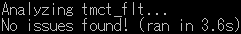
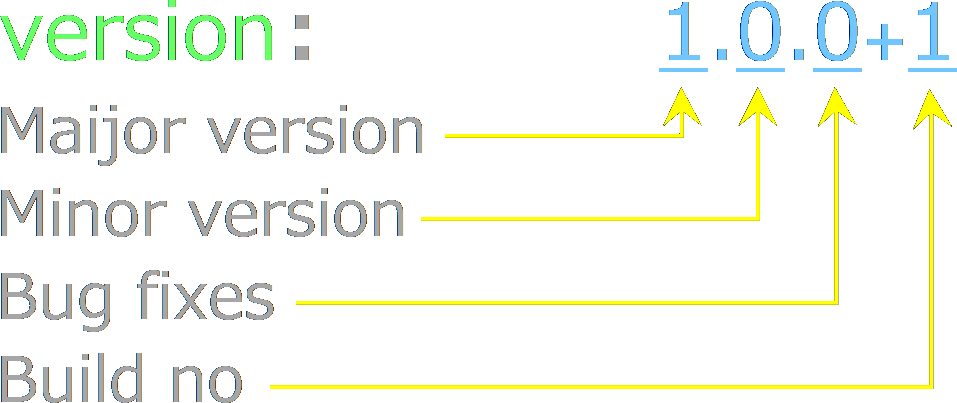
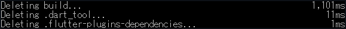
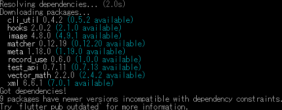
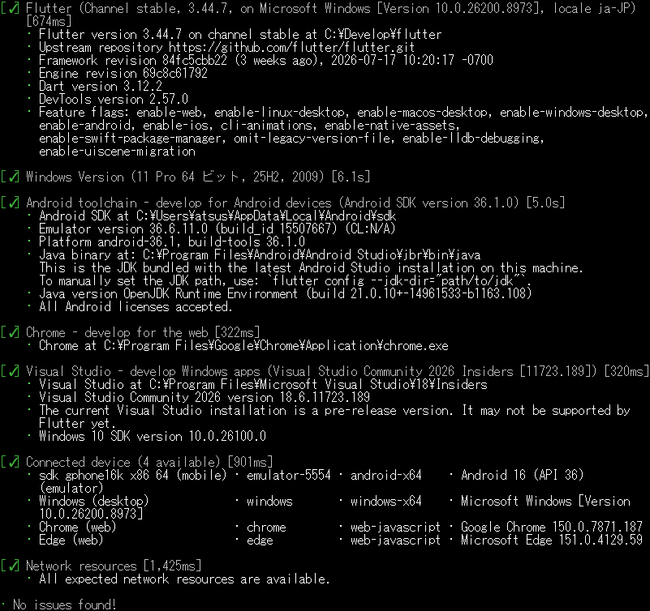

<p akugb=:keft>  
	  
	  
</p>  
  
# Mobileアプリケーション作成											<!-- 02 -->  
　リハビリテーション用カウントダウンタイマー&カウンター [**tmct_flt**] を作成します。  
　  
> [!NOTE]  
> 
> ※ 凡例  
> 　 デスクトップ、️：マウスクリック、 ：ボタン、：Press the Key、：Enter key press、  
> 　：テキスト、**a** / **b**：選択(**a** or **b**)、：ウィンドウ/メニュー/フォーム、⇒：次動作、：コメント、  
>　：ターミナル、：クリックでText表示 (コピー可能)  

> [!NOTE]  
> 縮小表示されている画像は  で拡大されます (マウスカーソルが  になる画像が縮小表示画像です)。  
>  本章のコマンドは全て　 　にて実行しています。

## Coding														<!-- 02-01 -->  
　コーディング過程は省略。  
　ソースコード[tmct_flt]は下記参照。  
| Created file |  Location |  
|:---|:---|  
| [ main.dart](https://github.com/AHazeyama/public/blob/main/tmct_flt/lib/main.dart) | Project_dir \ lib \ |  
| [ pubspec.yaml](https://github.com/AHazeyama/public/blob/main/tmct_flt/pubspec.yaml) | Project_dir \ |  
  
## アプリケーションのインストール									<!-- 02-02 -->  
#### 開発環境確認  
<details>   								<!-- flutter doctor -v -->
<summary>
  

&nbsp;  
</summary>  
  
```  
flutter doctor -v
```  
</details>  

　[](./assets/prtsc/M_ER_02_flutter-doctor-v.png)  
  
  
<details>   								<!-- flutter devices -->
<summary>
  

&nbsp;  
</summary>  
  
```  
flutter devices
```  
</details>  

　[](./assets/prtsc/M_ER_02_flutter-devices.png)  
  
#### ファイルバックアップ  
　｢Coding｣で作成したファイルをバックアップ。  
  
#### Androidフォルダ生成  
<details>   	<!-- flutter create --platforms=android --project-name "PRJ_name" -->
<summary>
  

&nbsp;  
</summary>  
  
```  
flutter create --platforms=android --project-name "PRJ_name"  
```  
</details>  

　[](./assets/prtsc/M_ER_02_flutter-pub-get.png)  
  
#### パッケージ取得  
<details>   												<!-- flutter pub get -->
<summary>
  

&nbsp;  
</summary>  
  
```  
flutter pub get  
```  
</details>  
　  

　  
#### アイコン生成  
　アイコンファイル追加  
<details>   					<!-- flutter pub add --dev flutter_launcher_icons -->
<summary>
  

&nbsp;  
</summary>  
  
```  
flutter pub add --dev flutter_launcher_icons  
```  
</details>  

　[](./assets/prtsc/M_ER_02_dart-run-flutter_luncher_icons.png)  
  
　アイコンファイル登録  
<details>   								<!-- dart run flutter_launcher_icons -->
<summary>
  

&nbsp;  
</summary>  
  
```  
dart run flutter_launcher_icons  
```  
</details>  
　[](./assets/prtsc/M_ER_02_dart-run-flutter_luncher_icons.png)  

  
  
> [!NOTE]  
> [](./assets/prtsc/02-02-06_dart-run-flutter_luncher_icons_warn.png)  
> iOS環境を作成していない場合、上記Warningが出力される。  
> 原因はiconファイルのフォルダ階層かファイル名の不一致。  
> またはpubspec.yamlで"ios:**True**"になってる ⇒ **False**へ変更。  
>   
  
　本チュートリアルでは自動生成されたサンプルテストを使用しないため、testフォルダを削除します。  
　　 : .\ Project_dir \  TEST  
<details>   												<!-- flutter analyze -->
<summary>
  

&nbsp;  
</summary>  
  
```  
flutter analyze  
```  
</details>  
  
  

> [!NOTE]  
> 参考:TESTフォルダを削除しなかった場合のメッセージ  
> [](./assets/prtsc/M_ER_02_flutter-analyze-error.png)  
  
#### インストール  
　Emulator 確認 (FlutterからAndroid StudioのEmulatorが操作可能かを確認)  
<details>   												<!-- flutter devices -->  
<summary>
  

&nbsp;  
</summary>  
  
```  
flutter devices  
```  
</details>  

　[](./assets/prtsc/M_ER_02_flutter-devices2.png)  
  
　Emulator へインストール   
<details>   										<!-- flutter run emulator-5554 -->
<summary>
  
  
&nbsp;  
</summary>  
  
```  
flutter run emulator-5554  
```  
</details>  

　[](./assets/prtsc/02-02-10_flutter-run-emulator-5554.png)　　  
  
　Emulator表示の遷移  
|Initial|Installing...|Running|After execution|  
|:---|:---|:---|:---|  
|[ ](./assets/prtsc/M_IMG_02_emulator.png)| [ ](./assets/prtsc/M_IMG_02_emulator-start.png)| [](./assets/prtsc/M_IMG_02_emulator-run.png)| [](./assets/prtsc/M_IMG_02_emulator-after.png)|  
  
## デバッグ (Emulator)											<!-- 02-03 -->  
　Android StudioからEmulatorを起動し、tmct_fltをデバッグ実行します。  
### 操作手順  
1. Emulatorを起動  
2. tmct_fltプロジェクトを開く  
3. 実行対象デバイスを選択  
4. Debugを実行  
5. ログ及び動作を確認  
  
### 主な確認項目  
- タイマーが設定値からカウントダウンする  
- Start、Stop、Clearが正しく動作する  
- カウンターが正しく更新される  
- 残り10秒で表示が変化する  
- 終了時に音及び振動が動作する  
- 設定値が保存される  
- Version等、設定内容が記録されている  
  
<!-- 後日、SoftwareDevelopmentGuide整備後に記載  
#### 項目設定方法  
　[ SoftwareDevelopmentGuideへのリンク]  
-->  
## 配布用アプリケーション(.apk)作成										<!-- 02-04 -->  
### バージョン設定  
　pubspec.yaml 内で設定  
　　  
　バージョン内容  
　　  
|Version Name|Details of Add-ons|  
|:---|:---|  
|Major version|主要機能の追加|  
|Minor version|機能変更、小規模追加|  
|Bug fixes|バグ対策|  
|build no|機能変更を伴わない修正、内部的なバグ対策|  

### Release Build  
#### 環境整備  
<details>   													<!-- flutter clean -->
<summary>
  

&nbsp;  
</summary>  
  
```  
flutter clean  
```  
</details>  

　  
  
#### パッケージ取得  
<details>   													<!-- flutter pub get -->
<summary>
  

&nbsp;  
</summary>  
  
```  
flutter pub get  
```  
</details>  

　  
<details>   												<!-- flutter doctor -v -->
<summary>
  

&nbsp;  
</summary>  
  
```  
flutter doctor -v  
```  
</details>  
  
　[](./assets/prtsc/M_ER_02_flutter-doctor-v2.png)  
<details>   													<!-- flutter pub get -->
<summary>
  

&nbsp;  
</summary>  
  
```  
flutter build apk --release  
```  
</details>  

[](./assets/prtsc/M_ER_02_flutter-build-apk-release.png)  
  
　Buildアプリケーション保存 🗁 : `Project folder` \build\app\outputs\flutter-apk\  
  
#### アプリケーションリネーム  
　Buildで生成される.apkは **app-release.apk** となっているので、**アプリケーション名+version.apk** へリネームする。  
  
> [!TIP]  
> **アプリケーション名_V1.0.0.0+1** といった名称でも、スマートフォンへインストールするとversionは表示されない。  
>  アプリ情報で確認できます。  