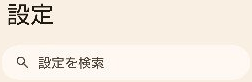
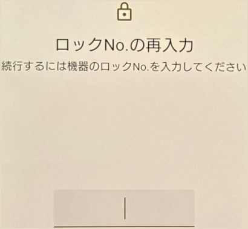
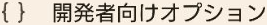
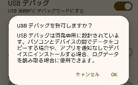
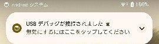
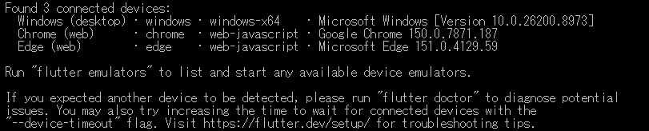
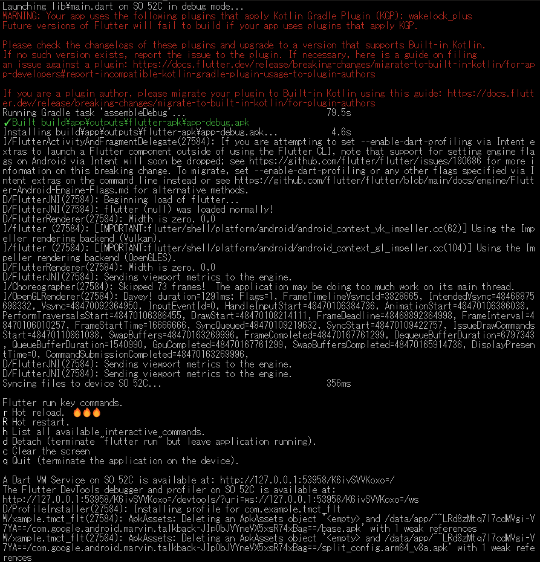
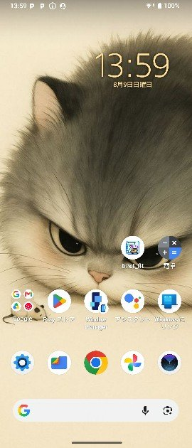

<p akugb=:keft>  
	  
	  
</p>  
  
# 実機検証																<!-- 04 -->  
　  
　実機検証にはスマートフォン**Xperia 10 IV**を使用しています。  


> [!NOTE]  
> ※ 凡例  
> 　 デスクトップ、️：マウスクリック、 ：ボタン、：Press the Key、：Enter key press、  
> 　：タップ、：テキスト、**a** / **b**：選択(**a** or **b**)、：ウィンドウ/メニュー/フォーム、⇒：次動作、：コメント、  
>　：ターミナル、：クリックでText表示 (コピー可能)  

> [!NOTE]  
> 縮小表示されている画像は  で拡大されます (マウスカーソルが  になる画像が縮小表示画像です)。  
>  本章のコマンドは全て　 　にて実行しています。

## USB接続でのインストール										<!-- 03-01 -->  
### スマートフォン側USBデバッグ準備  
　USBデバッグモードOn  
　  
|Image|Operation|  
|:---|:---:|  
|　**/**　 ||  
|　**/**　||  
|　**/**　| x**7**|  
|[](./assets/prtsc/M_AD_M_lock-no.png)|入力|  
|[](./assets/prtsc/M_AD_M_developer-options-on.png)| ⇒ |  
|　**/**　||  
|　**/**　||  
|　**/**　| |  
|[](./assets/env/M_AD_M_developer-options-usb-on.png)|[**OK**]  ⇒ HOME画面へ|  
| スマートフォンとPCをUSB接続||  
||確認|  
  
### アプリケーションインストール & 実行  
#### PC側作業  
<details>   												<!-- flutter devices -->
<summary>
  
  
&nbsp;  
</summary>  
  
```  
flutter devices  
```  
</details>  

　[](./assets/prtsc/M_ER_03_flutter-devices.png)  
<details>   												<!-- flutter pub get -->
<summary>
  
  
&nbsp;  
</summary>  
  
```  
flutter run -d "実機のDeviceID"
```  
</details>  

　[](./assets/prtsc/M_ER_03_flutter-run-HQ632N105E.png)  
  
#### 画面遷移  
　  
|Initial|Installing...|Running|After execution|  
|:---|:---|:---|:---|  
| [](./assets/prtsc/M_AD_home03.png)>|[](./assets/prtsc/M_AD_home-install.png)|[](./assets/prtsc/M_AD_tmct.png)|[](./assets/prtsc/M_AD_home04.png)|  
  
## 検証															<!-- 03-03 -->  
### 操作手順  
1. Xperia 10 IVでtmct_fltを起動  
2. タイマーを設定  
3. 各操作を実行  
4. 音・振動・表示を確認  
5. アプリを終了／再起動して設定保持を確認  
  
### 主な確認項目  
  
- タイマーが設定値からカウントダウンする  
- Start、Stop、Clearが正しく動作する  
- カウンターが正しく更新される  
- 残り10秒で表示が変化する  
- 終了時に音及び振動が動作する  
- 設定値が保存される  
- アプリ終了後に再起動出来る  
- HOMEへ戻った後、再起動出来る  
- Version等、設定内容が記録されている  
  
<!-- 後日、SoftwareDevelopmentGuide整備後に記載  
#### 項目設定方法  
　※ SoftwareDevelopmentGuideへのリンク  
-->  
  
