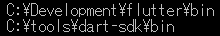
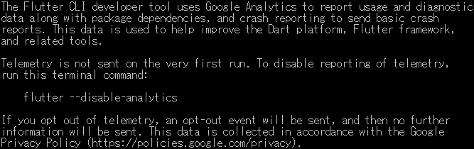

<p akugb=:keft>  
	  
	  
</p>  

# 開発環境初期化
　インストール済みの **Flutter** と **Android Studio**  及びその環境、生成物の削除を行います。  
> [!CAUTION]
> この手順では、Flutter SDK、Android SDK、Android Emulator、
> Android Studioの設定及び各種キャッシュを削除します。
>
> **既存のFlutter／Android開発環境を継続して使用する場合は、
> この手順を実行しないでください。**
>
> 削除したSDK、仮想端末及び設定は元に戻せません。
> 必要なプロジェクト、設定、仮想端末及びファイルがある場合は、
> 必ず事前にバックアップしてください。

> [!NOTE]  
> 縮小表示されている画像は⬇️で拡大されます。  
> 
> ```pwsh  
> ※ 記号例  
> 　🪟:デスクトップ、⬇️:マウスクリック、 [･･･]:ボタン、<･･･>:Press the Key、⇒:次動作、#･･･:コメント  
> 　"･･･":テキスト、a/b:選択(a or b)、｢･･･｣:ウィンドウ/メニュー/フォーム、  
> ```  
  
## 環境確認
### 　Flutter SDK 環境  
　この章のコマンドは全て にて実行 。　※<⏎> : Enter key press  
　現在の開発環境確認  

　Path確認  
```pwsh  
　where.exe flutter <⏎>  
```  
　　  
  
　Flutter確認  
```pwsh  
　flutter doctor -v <⏎>  
```  
　　[](./assets/prtsc/APP-02_flutter-doctor.png)  

### 　Android 環境  
```pwsh  
　Get-ChildItem Env: |  
　    Where-Object {  
　        $_.Name -match 'ANDROID|JAVA|FLUTTER|DART|GRADLE|PUB'  
　    } |  
　    Sort-Object Name <⏎>  
```  
　　  
  
　Path確認  
```pwsh  
$env:Path -split ';' |  
    Where-Object {  
        $_ -match 'flutter|android|dart|gradle|java'  
    } <⏎>  
```  
　　  
  
## 環境削除																<!-- APP-02 -->  

> [!WARNING]
> 本章以降のコマンドは対象ディレクトリを確認してから実行してください。  
> 環境によってインストール先が異なる場合があります。

### Android Studio 削除  
　EmulatorはAndroid Studioから削除  
　残骸が残っていたら削除 : %USERPROFILE%\.android\avd  
　🖥️左下｢ ️ ｣⬇️ ⇒ ｢  ｣右⬇️ ⇒ ｢  ｣ ⇒  
　｢⚙️Window｣ ⇒ ｢　　｣⬇️ ⇒ 「アンインストール」

### Android Studio 削除 確認  
```pwsh
　Test-Path "C:\Program Files\Android\Android Studio" <⏎>
　true
　Remove-Item -Recurse -Force "C:\Program Files\Android\Android Studio" <⏎>
```
### Android SDK 環境  
```pwsh
　Remove-Item -Recurse -Force "$env:LOCALAPPDATA\Android\Sdk" <⏎>
```
### $HOMEの環境 削除
```pwsh
　Remove-Item -Recurse -Force "$env:USERPROFILE\.android" <⏎>
```
### 設定 及び キャッシュ 削除  
#### 環境変数
```pwsh
　Get-ChildItem "$env:LOCALAPPDATA\Google" -Directory -Filter "Android Studio*" <⏎>
```
　　
```pwsh
　Get-ChildItem "$env:LOCALAPPDATA\Google" -Directory -Filter "Android Studio*" |
　　Remove-Item -Recurse -Force <⏎>
　Get-ChildItem "$env:APPDATA\Google" -Directory -Filter "Android Studio*" |
　　-ErrorAction SilentlyContinue <⏎>
```
　　
```pwsh
　Get-ChildItem "$env:APPDATA\Google" -Directory -Filter "Android Studio*" | 
 　　-ErrorAction SilentlyContinue Remove-Item -Recurse -Force <⏎>
```

#### Gradleキャッシュ 削除  
```pwsh
　Remove-Item -Recurse -Force "$env:USERPROFILE\.gradle" <⏎>
```

### Flutter SDK 削除  
```pwsh
　where.exe flutter <⏎>
```
　
```pwsh
　Remove-Item -Recurse -Force "C:\Develop\flutter" <⏎>
```

### Flutter & Dart 設定･キャッシュ 削除  
```pwsh
　$dartPaths = @(
    "$env:APPDATA\.dart",
    "$env:APPDATA\.dart-tool",
    "$env:LOCALAPPDATA\.dartServer"
　)

　foreach ($path in $dartPaths) {
    if (Test-Path $path) {
        Remove-Item -Recurse -Force $path
    }
　} <⏎>　# ⚠️<⏎>前までコピーして実行
```
> [!NOTE]
> 実行メッセージが一瞬表示される。スクリーンショットは撮り逃し Orz m(_ _)m…  
```pwsh
　Remove-Item -Recurse -Force "$env:LOCALAPPDATA\Pub\Cache" -ErrorAction SilentlyContinue <⏎>
```

### プロジェクト内のBuild生成物 削除  
```pwsh
　flutter clean <⏎>
```
　

　🗁 : " **C:\Development\flutter** " を削除

## 再起動 ⇒  削除確認                                                   <!-- APP-03 -->  
### 削除対象  
　　　･Windows 環境変数  
　　　･Git for Windows  
　　　･VS Code 機能拡張   
　　　･Flutter SDK  
　　　･Android Studio  
　　　･Android SDK  
　　　･Android Emulator  

```pwsh
　Get-ChildItem "$env:USERPROFILE" -Force -Directory |
    Where-Object {
        $_.Name -match 'android|flutter|dart|gradle'
    } <⏎>

　Get-ChildItem "$env:LOCALAPPDATA" -Force -Directory |
    Where-Object {
        $_.Name -match 'android|flutter|dart|gradle|pub'
    } <⏎>
```
　
```pwsh
　Get-ChildItem "$env:APPDATA" -Force -Directory |
    Where-Object {
        $_.Name -match 'android|flutter|dart|gradle|pub'
    } <⏎>
```
　

## 完了確認                                                             <!-- APP-04 -->  

次の状態になっていれば、開発環境の構築は完了です。

- `flutter doctor -v` でFlutter及びAndroid toolchainが認識される
- Androidライセンスが承認済み
- Android StudioからPixel 7 Emulatorを起動できる
- VS CodeでFlutter及びDart拡張機能が有効になっている