<p akugb=:keft>  
	  
	  
</p>  
  
# 開発環境初期化  
　インストール済みの **Flutter** と **Android Studio**  及びその環境、生成物の削除を行います。  

> [!NOTE]  
> ※ 凡例  
> 　 デスクトップ、️：マウスクリック、 ：ボタン、：Press the Key、：Enter key press、  
> 　：タップ、：テキスト、**a** / **b**：選択(**a** or **b**)、：ウィンドウ/メニュー/フォーム、⇒：次動作、：コメント、  
>　：ターミナル、：クリックでText表示 (コピー可能)  

> [!NOTE]  
> 縮小表示されている画像は  で拡大されます (マウスカーソルが  になる画像が縮小表示画像です)。  
>  本章のコマンドは全て　 　にて実行しています。

> [!CAUTION]  
> この手順では、Flutter SDK、Android SDK、Android Emulator、  
> Android Studioの設定及び各種キャッシュを削除します。  
>  
> **既存の Flutter / Android 開発環境を継続して使用する場合は、  
> この手順を実行しないでください。**  
>  
> 削除したSDK、仮想端末及び設定は元に戻せません。  
> 必要なプロジェクト、設定、仮想端末及びファイルがある場合は、  
> 必ず事前にバックアップしてください。  
  
## 環境確認                                                     <!-- APP -->  
### 　Flutter SDK 環境                                          <!-- APP-01 -->  
　現在の開発環境確認  
　Path確認  
<details>   												<!-- where.exe flutter -->
<summary>
  

&nbsp;  
</summary>  
  
```  
where.ese flutter  
```  
</details>  


　  
  
　Flutter確認  
<details>   												<!-- flutter doctor -v -->
<summary>
  

&nbsp;  
</summary>  
  
```  
flutter doctor -v  
```  
</details>  

　[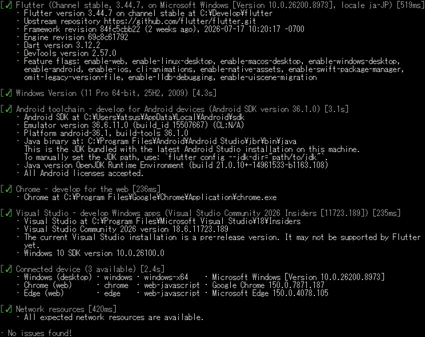](./assets/prtsc/M_ER_APP_flutter-doctor-v.png)  
  
### 　Android 環境  
#### 　既存環境確認  
<details>   												<!-- Get-ChildItem Env -->
<summary>
  
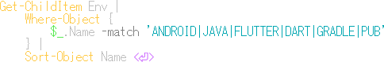  
</summary>  
  
```  
Get-ChildItem Env |
    Where-Object {
        $_.Name -match 'ANDROID|JAVA|FLUTTER|DART|GRADLE|PUB'
    } |
    Sort-Object Name
```  
</details>  
  
　  
  
#### 　Path確認  
<details>   												<!-- env:Path -split -->
<summary>
  
  
</summary>  
  
```
$env:Path -split ';' |
    Where-Object {
        $_ -match 'flutter|android|dart|gradle|java'
    }
```  
</details>  

　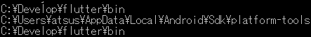  
  
## 環境削除								    				    <!-- APP-02 -->  
  
> [!WARNING]  
> 本章以降のコマンドは対象ディレクトリを確認してから実行してください。  
> 環境によってインストール先が異なる場合があります。  
  
### プロジェクト内のBuild生成物 削除  
  
<details>   												<!-- Get-ChildItem Env -->
<summary>
  

&nbsp;  
</summary>  
  
```  
flutter clean  
```  
</details>  
  
　# 正常終了はメッセージ無し  
  
> [!NOTE]  
>　  
> 上記記メッセージが出力された場合はアップグレード  
><details>   												<!-- Get-ChildItem Env -->
><summary>
>  
>
>&nbsp;  
></summary>  
>  
>```  
>flutter clean  
>```  
></details>  
>
>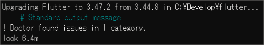  
>
>[ メッセージ全文](./assets/prtsc/APP-02-00b_flutter-upgrade-all.png)  
  
### Android Studio 削除  
　EmulatorはAndroid Studioから削除  
　残骸が残っていたら削除 : %USERPROFILE%\.android\avd  
　🖥️左下｢ ️  ]⬇️ ⇒ ｢  ｣右⬇️ ⇒ ｢  ｣⬇️ ⇒  
　｢⚙️Window｣ ⇒ ｢　　｣⬇️ ⇒ 「アンインストール」  
  
### Android Studio 削除確認 残項目があれば強制削除  
<details>   														<!-- Test-Path -->
<summary>
  

&nbsp;  
</summary>  
  
```  
flutter clean  
```  
</details>  

　　# 環境が存在する  
<details>   										<!-- Remove-Item -Recurse -Force -->
<summary>
  

&nbsp;  
</summary>  
  
```  
Remove-Item -Recurse -Force "C:\Program Files\Android\Android Studio" 
```  
</details>  
　# メッセージ無し　`※正常に削除された場合、メッセージは出力されない  
  
### Android SDK 環境 削除  
<details>   									<!-- remove-item-localappdata-sdk -->  
<summary>
  

&nbsp;  
</summary>  
  
```  
flutter clean  
```  
</details>  

　[](./assets/prtsc/M_ER_APP_remove-item-localappdata-sdk1.png)  
　　　　　　　　　　　  
　[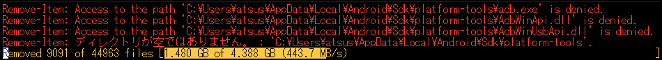](./assets/prtsc/M_ER_APP_remove-item-localappdata-sdk2.png)  
　　　　　　　　　　　
　[](./assets/prtsc/M_ER_APP_remove-item-localappdata-sdk3.png)  
　残環境 **：** $HOME\AppData以下はこの後削除します。  
  
### $HOMEの環境 削除  
<details>   										<!-- get-childitem-android-sdk -->
<summary>
  
  
&nbsp;  
</summary>  
  
```  
flutter clean  
```  
</details>  

　[](./assets/prtsc/M_ER_APP_Get-ChildItem-android.png)  
  
<details>   				<!-- Remove-Item -Recurese -Force USERPROFILE-android -->
<summary>
  

&nbsp;  
</summary>  
  
```  
flutter clean  
```  
</details>  
　# メッセージ無し　`※正常に削除された場合、メッセージは出力されない`  
  
### 設定 及び キャッシュ 削除  
> [!IMPORTANT]  
> Android Studioで生成されたディレクトリは "**AndroidStudio** "、"**Android Studio**"等のバリエーションが存在する。  
> **Get-ChildItem** で検索出来たディレクトリそれぞれに適した **Remove-Item** コマンドを実行  
#### Local環境/キャッシュ  
　🗁 : $HOME\AppData\Local\Google\  
<details>   							<!-- Get-ChildItem env:LOCALAPPDATA-Google -->
<summary>
  
u
&nbsp;  
</summary>  
  
```  
Get-ChildItem "$env:LOCALAPPDATA\Google" -Directory -Filter "Android*"  
```  
</details>  

　
<details>   							<!-- Remove -Item-LOCALAPPDATA-google -->
<summary>
  
  
&nbsp;  
</summary>  
  
```  
Remove-Item -Recurse -Force "$env:USERPROFILE\.android"  
```  
</details>  

　# メッセージ無し　`※正常に削除された場合、メッセージは出力されない`  
　🗁 : $HOME\AppData\Roaming\Google\  
<details>   				    			<!-- Get-ChildItem env:APPDATA-Google -->
<summary>
  
u
&nbsp;  
</summary>  
  
```  
Get-ChildItem "$env:APPDATA\Google" -Directory -Filter "Android*"  
```  
</details>  

　[](./assets/prtsc/M_ER_APP_Get-ChildItem-env-appdata-google.png)  
<details>   					                <!-- Remove-Item-APPDATA-google -->
<summary>
  
  
&nbsp;  
</summary>  
  
```  
Remove-Item -Recurse -Force "$env:APPDATA\"  
```  
</details>  
  
　# メッセージ無し　`※正常に削除された場合、メッセージは出力されない`  
#### Gradleキャッシュ 削除  
<details>   				    			<!-- Get-ChildItem env:USERPROFILE-gradle -->
<summary>
  

&nbsp;  
</summary>  
  
```  
Get-ChildItem "$env:APPDATA\Google" -Directory -Filter "Android*"  
```  
</details>  

　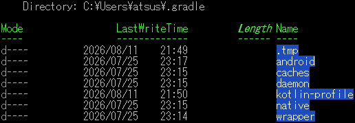  
  
<details>   					                <!-- Remove-Item-APPDATA-google -->
<summary>
  

&nbsp;  
</summary>  
  
```  
Remove-Item -Recurse -Force "$env:USERPROFILE\.gradle"
```  
</details>  

　[](./assets/prtsc/APP-02-06_Remove-Item-grable.png)  
　# プログレスバーの消滅で削除完了  
  
### Flutter SDK 削除  
<details>   		            			                <!-- where.exe flutter -->  
<summary>
  

&nbsp;  
</summary>  
  
```  
where.exe flutter  
```  
</details>  

　  
　他のメッセージが無く、プロンプトが表示されれば削除完了  
<details>   		                        <!-- Get-ChildItem C:\Develop\flutter" -->  
<summary>
  

&nbsp;  
</summary>  
  
```  
Get-ChildItem "C:\Develop\flutter"
```  
</details>  

　[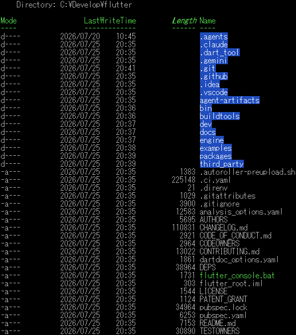](./assets/prtsc/M_ER_APP_get-childItem-develop-flutter.png)  
<details>                   <!-- Remove-Item -Recurse -Force "C:\Develop\flutter"  -->
<summary>
  

&nbsp;  
</summary>  
  
```  
Remove-Item -Recurse -Force "C:\Develop\flutter"  
```  
</details>  


　[](./assets/prtsc/M_ER_APP_get-childItem-develop-flutter.png)  
　# プログレスバーの消滅で削除完了  

## Flutter & Dart 設定･キャッシュ 削除  
<details>                   <!-- Remove-Item -Recurse -Force "C:\Develop\flutter"  -->
<summary>
  
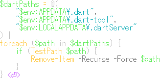
</summary>  
  
```  
$dartPaths = @(
    "$env:APPDATA\.dart",
    "$env:APPDATA\.dart-tool",
    "$env:LOCALAPPDATA\.dartServer"
) |
foreach ($path in $dartPaths) {
    if (TestPath $path) {
        Remove-Item -Recurse -Force $path
    }
}
```  
</details>  

> [!NOTE]  
> 実行メッセージが一瞬表示される。  
> 他のメッセージが無く、プロンプトが表示されれば削除完了  
  
<details>                   <!-- Get-ChildItem "$env:LOCALAPPDATA\Pub\Cache" -->
<summary>
  
  
&nbsp;  
</summary>  
  
```  
Get-ChildItem "$env:LOCALAPPDATA\Pub\Cache"
```  
</details>  

　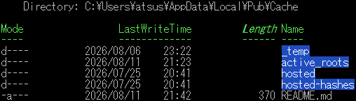
<details>                      <!-- Remove-Item "$env:LOCALAPPDATA\Pub\Cache" -->
<summary>
  
  
&nbsp;  
</summary>  
  
```  
Remove-Item -Recurse -Force "$env:LOCALAPPDATA\Pub\Cache" -ErrorAction SilentlyContinue
```  
</details>  

　  
　# プログレスバーの消滅で削除完了  
　 : " **C:\Development\flutter** " を削除  
  
## 再起動 ⇒ 削除確認                                           <!-- APP-03 -->  
### 削除対象  
　　　･Windows 環境変数  
　　　･Git for Windows  
　　　･VS Code 機能拡張   
　　　･Flutter SDK  
　　　･Android Studio  
　　　･Android SDK  
　　　･Android Emulator  
  
<details>                                     <!-- Get-ChildItem $env:USERPROFILE -->  
<summary>
  
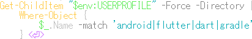  
　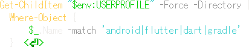  
</summary>  
  
```  
Get-ChildItem "$env:USERPROFILE" -Force -Directory |
    Where-Object {
        $_.Name -match 'android|flutter|dart|gradle'
    }
```  
</details>  

　  
<details>                             <!-- Remove-Item '$env:USERPROFILE\上記DIR' -->
<summary>
  
  
&nbsp;  
</summary>  
  
```  
Remove-Item -Recurse -Force "$env:USERPROFILE\上記DIR"
```  
</details>  
　# 正常に削除できればメッセージ無し  

<br>
<details>                                     <!-- Get-ChildItem $env:USERPROFILE -->  
<summary>
  
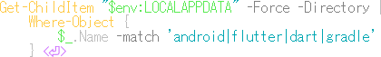  
</summary>  
  
```  
Get-ChildItem "$env:LOCALAPPDATA" -Force -Directory |
    Where-Object {
        $_.Name -match 'android|flutter|dart|gradle'
    }
```  
</details>  

<details>                             <!-- Remove-Item '$env:LOCALAPPDATA\上記DIR' -->
<summary>
  
  
&nbsp;  
</summary>  
  
```  
Remove-Item -Recurse -Force "$env:LOCALAPPDATA\上記DIR"
```  
</details>  
  
> [!NOTE]  
> Get-ChidlItemで抽出されたDIRを個別に削除  
  
<details>                                     <!-- Get-ChildItem $env:APPDATA -->  
<summary>
  
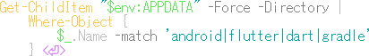  
</summary>  
  
```  
Get-ChildItem "$env:APPDATA" -Force -Directory |
    Where-Object {
        $_.Name -match 'android|flutter|dart|gradle'
    }
```  
</details>  

　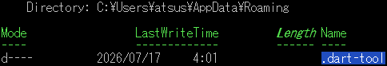

<details>                             <!-- Remove-Item '$env:APPDATA\上記DIR' -->
<summary>
  
  
&nbsp;  
</summary>  
  
```  
Remove-Item -Recurse -Force "$env:APPDATA\上記DIR"
```  
</details>  

　# 正常に削除できればメッセージ無し  
  
#### 残DIRの削除で初期化完了

