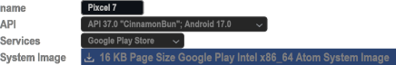
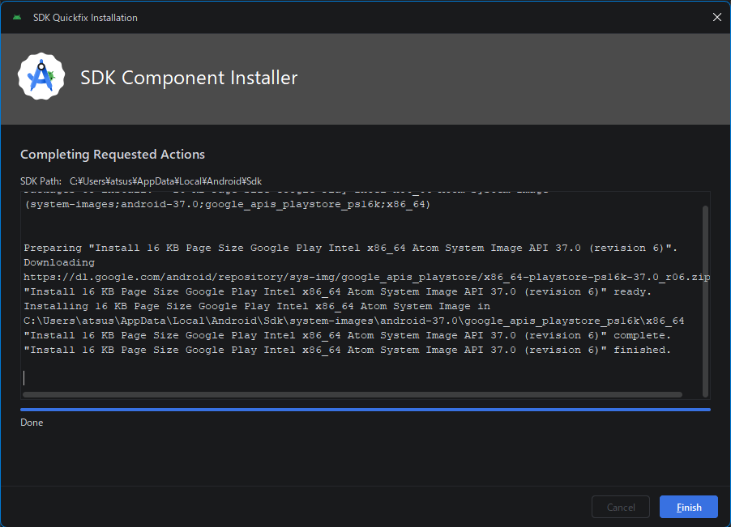
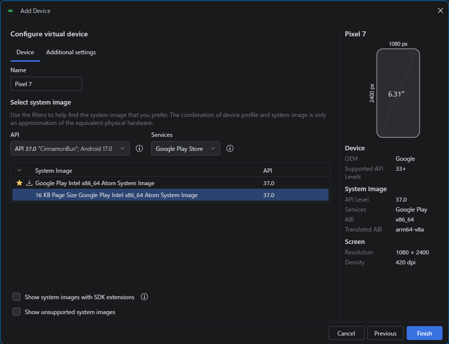

<p akugb=:keft>  
	  
	  
</p>  

　インストール済みの **Flutter** と **Android Studio**  の環境、生成物の削除を行います。  
> [!NOTE]  
> 縮小表示されている画像は⬇️で拡大されます。  
> 
> ```pwsh  
> ※ 記号例  
> 　🪟:デスクトップ、⬇️:マウスクリック、 [･･･]:ボタン、<･･･>:Press the Key、⇒:次動作、#･･･:コメント  
> 　"･･･":テキスト、a/b:選択(a or b)、｢･･･｣:ウィンドウ/メニュー/フォーム、  
> ```  
  
## Add Device  
　[](./assets/prtsc/AS_Device-Introduction/03-04-01i_AddDevice.png)  
　  

## Configure virtual device  
　[](./assets/prtsc/AS_Device-Introduction/03-04-02i_AD-Configure-virtual-device.png)  
　  

## SDK Component Installer  
　[](./assets/prtsc/AS_Device-Introduction/03-04-03_AD-ComponentInstaller.png)   [](./assets/prtsc/AS_Device-Introduction/03-04-04_AD-ComponentInstaller.png_Finish.png)  
　  

## Configure virtual device
　[](./assets/prtsc/AS_Device-Introduction/03-04-05_AD-Configure-virtual-device.png)  
　  