<p align="left">  
	  
	  
</p>  
  
# OverView  
## 目的 : OS不問のMobileアプリケーション開発<br> 内容 : **Android** / **iOS** 両用開発環境を構築し、アプリケーション開発を行う  
|Item|Content|  
|:--|:--|  
|OS||  
|言語||  
|FrameWork||  
|IDE||  
|Editor|　　|  
|検証機材||  
  
　※ 記号例  
```  
　🪟:デスクトップ、⬇️:マウスクリック、 [･･･]:ボタン、<･･･>:Press the Key、⇒:次動作、#･･･:コメント
　"･･･":テキスト、a/b:選択(a or b)、｢･･･｣:ウィンドウ/メニュー/フォーム、  
```  

## リハビリテーション用タイマー&カウンター[tmct]作成手順  

> [!NOTE]
> 各画像は⬇️で拡大します。
### インストール  
　既に現環が存在する場合は末尾の ｢**現環境削除**｣ 項参照  
### 環境確認  
　  
　```pwsh  
git --version <⏎>  
　```  
　　  
　```pwsh  
code --version <⏎>  
　```  
　　  

### Flutter インストール  
　　👇ボタンより FlutterSDK バンドルをダウンロード  
　　[](https://storage.googleapis.com/flutter_infra_release/releases/stable/windows/flutter_windows_3.44.8-stable.zip)  🔗[Install Flutter manually](https://docs.flutter.dev/install/manual)  
　解凍して任意のフォルダへ保存　　推奨：🗁 C:\Develop\  

### 環境変数登録
　画面左下の  へ"環境変数"を入力して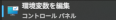 を⬇️  
　｢･･･のユーザー環境変数(<u>U</u>)｣ ⇒ ｢Path｣ ⇒ [編集(<u>E</u>)…] ⇒ ｢環境変数名の編集｣/[新規] ⇒ 追加 "C:\Develop\flutter\bin"  
　　　[](./assets/prtsc/01-06_ControlPanel.png)  

### パス確認  
　  
　```
　flutter --verison <⏎>
　```  
　　　[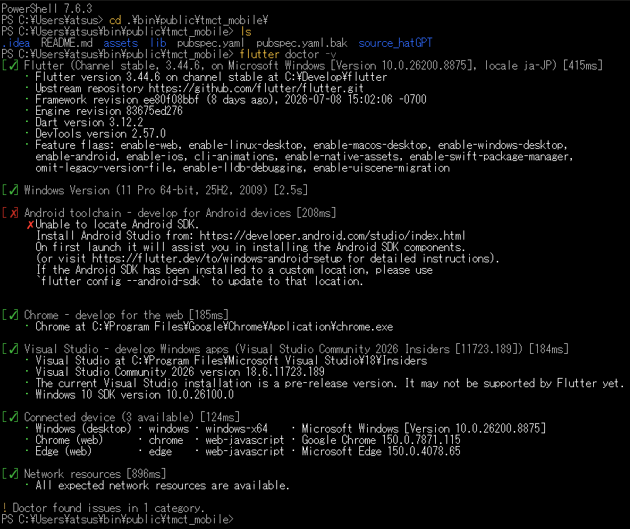](./assets/prtsc/01-07_FlutterDiag1st.png)  

  
### VS Code への機能拡張追加  
　  
　左ツールバーの  ⬇️ 、又は ⚙️⬇️ ⇒ [機能拡張　Ctrl+Shift+X]⬇️ ⇒  

　[](./assets/prtsc/01-10_VSC-Flutter-Ext.png) **/** [](./assets/prtsc/01-11_VSC-Dart-Ext.png) をインストール  

### Flutter初回診断  
　  
　```  
flutter doctor -v <⏎>  
　```  
　　　[](./assets/prtsc/01-07_FlutterDiag1st.png)  
> [!IMPORTANT]  
> この時点ではAndroidにエラーが出ていても問題無し  
> Flutterがインストールされていれば **OK**  
  
### AndroidStudio インストール  
　  
　インストーラ入手  
　　🔗[Android Studio](https://developer.android.com/studio?hl=ja)　※使用許諾の必要があるため、リンク先の  よりダウンロード  
　　 W⬇️  
　　デフォルト設定でインストール  
　　SDKインストール先 : 🗁 C:\Users\ユーザー名\AppData\Local\Android\Sdk  

|Welcome|Choose Components|Configuration Settings|Choose StartMenu|Installing ⇒ <br>Complete|Completion Android Studio|  
|:--: |:--: |:--: |:--: |:--: |:--:|  
|[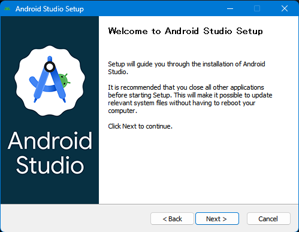](./assets/prtsc/02-03/02-03-01_Welcome.png)|[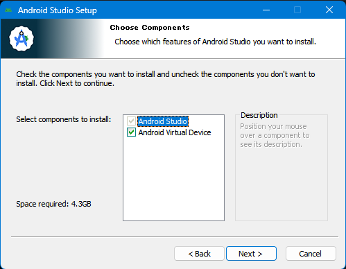](./assets/prtsc/02-03/02-03-02_ChooseComponents.png)|[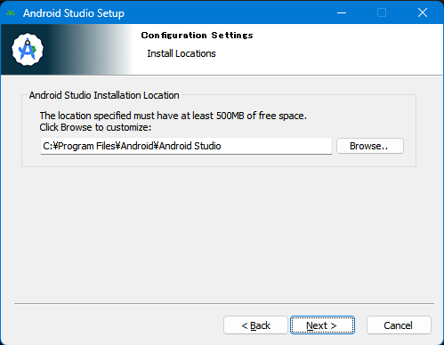](./assets/prtsc/02-03/02-03-03_Configuration.png)|[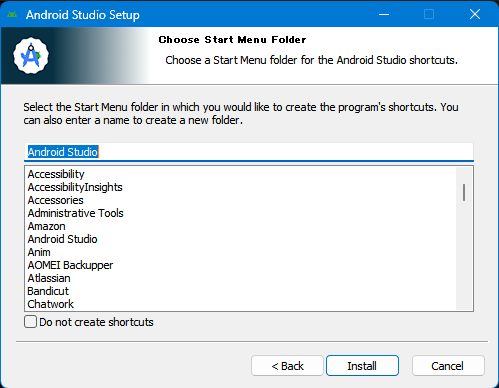](./assets/prtsc/02-03/02-03-04_ChooseStartMenu.png)|[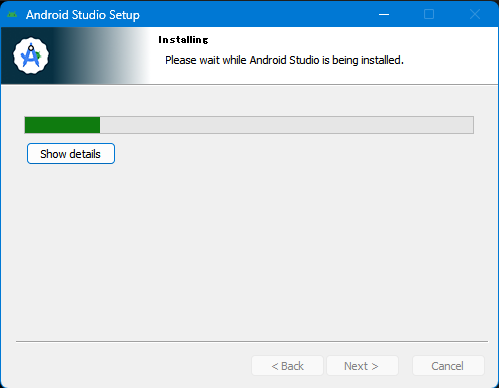](./assets/prtsc/02-03/02-03-05_Installing.png)⇒[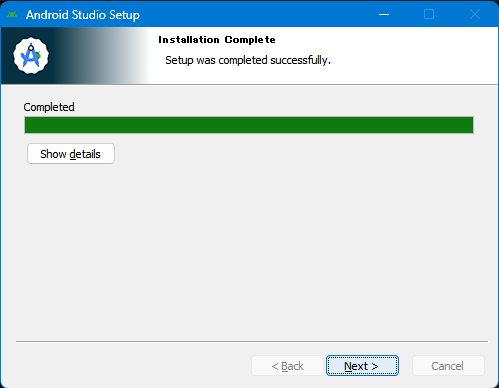](./assets/prtsc/02-03/02-03-06_InstallationConplete.png)|[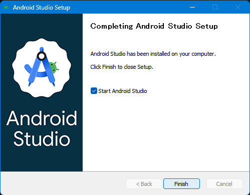](./assets/prtsc/02-03/02-03-07_CompletionAndroidStudio.png) |
|[<u>N</u>ext>]⬇️|[ <u>N</u> ext]⬇️|[<u>N</u>ext>⬇️]|[<u>I</u>nstall]⬇️|⌛wait ⇒ [<u>N</u>ext>]⬇️|[Finish]⬇️|  
---

### AndroidStudio セットアップ

|Welcome|Install Type|Verify Settings|License Agreement|DwnloadingCmp|
|:---:|:---:|:---:|:---:|:---:|  

|[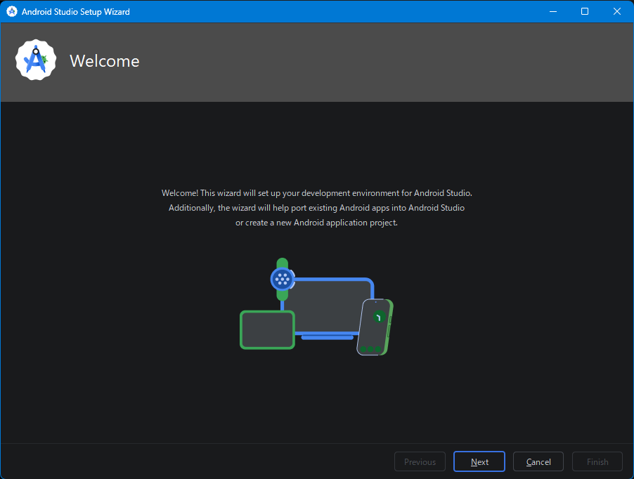](./assets/prtsc/02-04/02-04-01_welcome.png)
|[](./assets/prtsc/02-04/02-04-02_InstallType.png)
|[](./assets/prtsc/02-04/02-04-03_VerifySettings.png)
|[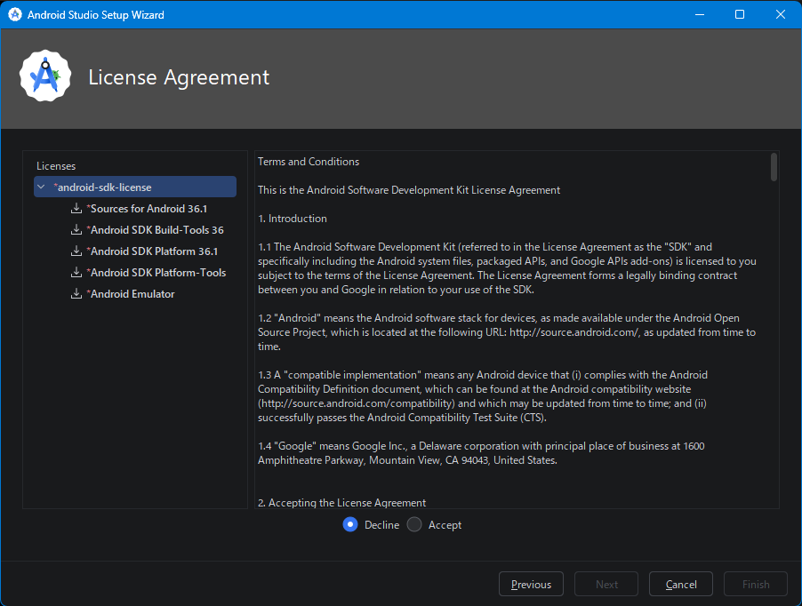](./assets/prtsc/02-04/02-04-04_LicenseAgreement1.png) ⇒ 
[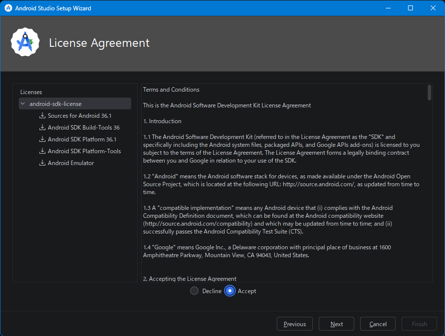](./assets/prtsc/02-04/02-04-05_LicenseAgreement2.png)
|[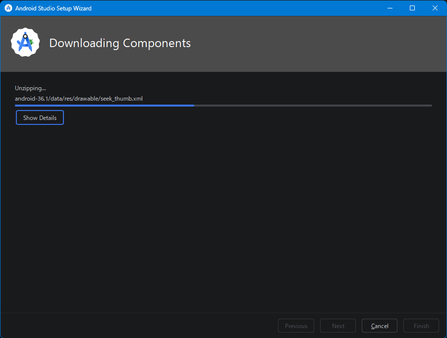](./assets/prtsc/02-04/02-04-06_DownloadingComponents1.png) ⇒ 
|[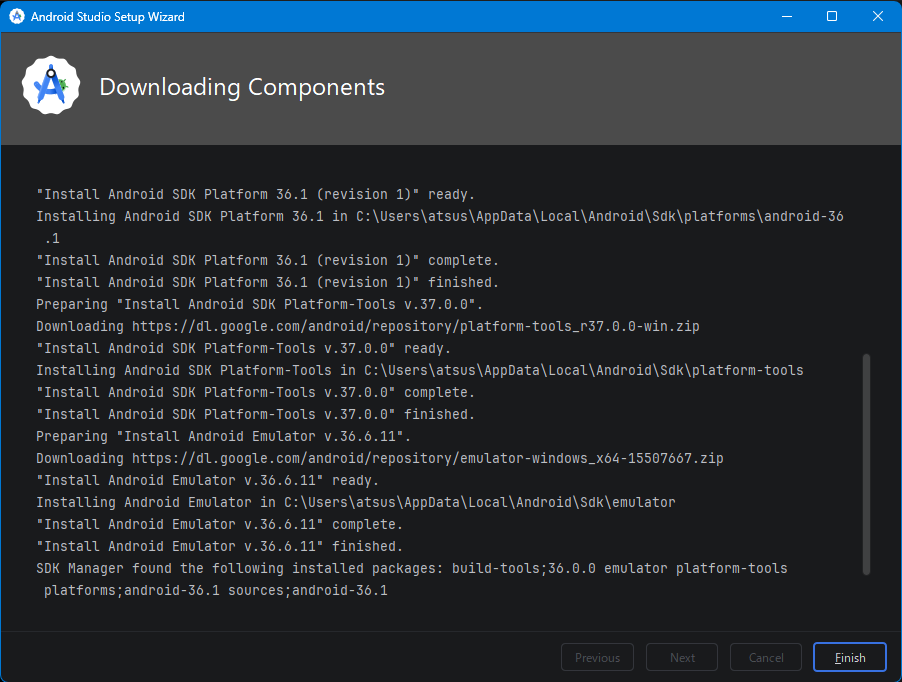](./assets/prtsc/02-04/02-04-07_DownloadingComponents2.png)|


|[<u>N</u>ext]⬇️|[⦿Standard]⬇️ ⇒ <br>[<u>N</u>ext]⬇️|[<u>N</u>ext]⬇️|[⦿Accept]⬇️ ⇒ <br>[<u>N</u>ext]⬇️|wait… [<u>F</u>inish]⬇️|  
---

### Project 作成
|Welcome|New Project|
|:---:|:---:|
|[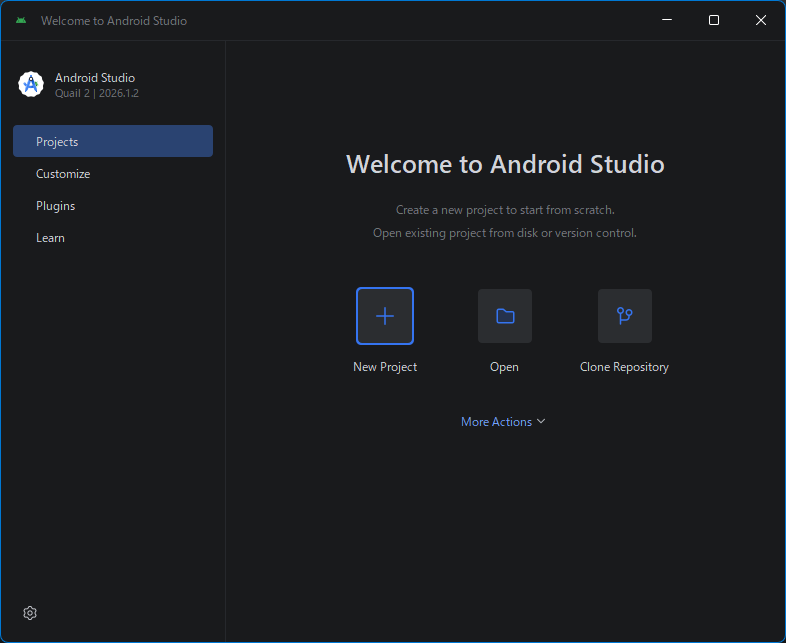](./assets/prtsc/06-01_Welcome-to-AndroidStudio.png) | [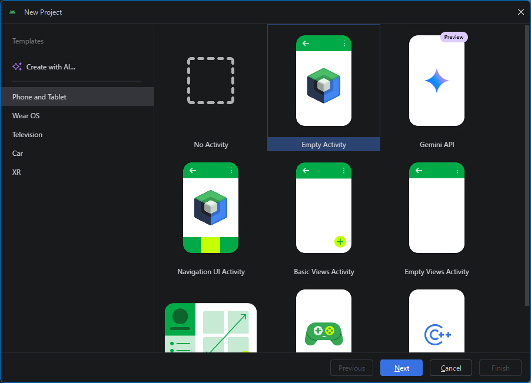](./assets/prtsc/06-02_New-Project.png) | 


　　  
  
### SDK Command_LIne_Tools インストール  
　  
　```  
Menu「☰｣⬇️ ⇒ ｢Tools」 ⇒ 「SDK manager」⬇️ ⇒  
　```  
　　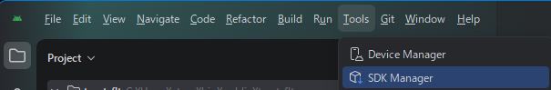  

> [!IMPORTANT]
> 必要項目の左に []️ がある場合は、先にクリックしてインストールすること。  

| | | | | |
|:---:|:---:|:---:|:---:|:---:|
|[OK]⬇️|**▢** Show Package⬇️ Details|[<u>A</u>pply]⬇️ ⇒ [OK]⬇️|[OK]⬇️|[OK]⬇️|
---

### Android ライセンス承認  
　  
```pwsh
flutter doctor --android-licenses <⏎>
```
　  
　以降、何度か"Accept? (y/N)"と聞かれるので、全て<y>で **OK**  
　  
　上記メッセージを確認。　
  
### 仮想端末登録  
　  
　```  
Menu「☰｣⬇️ ⇒ ｢Tools」 ⇒ 「Device manager」⬇️ ⇒  
　```  
　　  

> [!IMPORTANT]
> 必要項目の左に []️ がある場合は、先にクリックしてインストールすること。  

|Welcome|Install Type|Verify Settings|License Agreement|Downloading Components|
|:---:|:---:|:---:|:---:|:---:|
|[<u>N</u>ext]⬇️|[<u>N</u>ext]⬇️|[<u>N</u>ext]⬇️|｢ ⦿Accept ｣️⬇️ ⇒ [<u>N</u>ext]⬇️|[<u>F</u>inish]⬇️
---

<br>  
<br>  
<br>  
<br>  
<br>  
<br>  
<br>  
<br>  
<br>  
<br>  
<br>  
<br>  
<br>  
  
　右下[Apply]⬇️ ⇒ [OK]⬇️  
  
### Android ライセンス確認  
　  
　```  
flutter doctor --android-licenses <⏎>  
　```  
　  
  
### Emulator 起動  
　  
　```  
Menu「☰｣⬇️ ⇒ ｢Tools」 ⇒ 「SDK manager」⬇️ ⇒  
　```  
　  
  
  
  
  

　　MPLUSRoundedの入手  
　　[🔗Google Fonts!](./assets/prtsc/99-99-99_DownloadMPLUSRounded.png) から  を⬇️してダウンロード  

  
  
## VisualStudio起動  
## UIモジュール作成  
## イベント処理モジュール作成  
## ロジックモジュール作成  
## クラス指定明確化  
## プロジェクトファイル変更(WinFormsの有効化、単体起動exe作成コマンド)  
## テスト環境構築  
## バージョン管理登録(Git)  
### Git README.md 編集  
## ターミナル表示  
### Test環境構築  
## 動作確認  
### アプリ起動  
### 試行 ( 🗀test1st で実施 )  
## 単体アプリ作成  
### バージョン指定  
### icon 作成  
### Visual Studio  
### Visual Studio使わない方法  
## Git 更新 (README.md、exrm.exe)  
　｢VisualStudio｣  
　　右下の｢🖋️アイコン｣ ⬇️  
　｢Git 変更｣  
　　変更 / 追加したファイルをフォーカスし｢＋｣ ⬇️  
　　　｢メッセージを入力してください <必須>｣ にコメント入力  
　　[すべてをコミット] ⬇️  
  
  
<br>  
<br>  
<br>  
<br>  
  
  
## 現環境削除(必要に応じて)  
### 環境変数消去
　
```pwsh
$env:Path -split ';' |
    Where-Object {
        $_ -match 'flutter|android|dart|gradle|java'
    } <⏎>
```
　　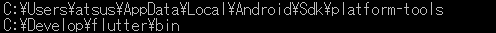  
　　🖥️作業  
```
　　🪟｢🔍検索｣へ"**環境変数**"入力 ⇒ ｢環境変数を編集｣⬇️ ⇒  
　　🪟｢環境変数｣ ⇒ ｢…のユーザー環境変数(U)｣ ⇒ ｢Path｣⬇️ ⇒ [編集(E)...] ⇒   
　　🪟｢環境変数名の編集｣ / [新規]⬇️ ⇒ "C:\Develop\flutter\bin"追加 ⇒ [OK]⬇️ ⇒ [OK]⬇️  
```
　　[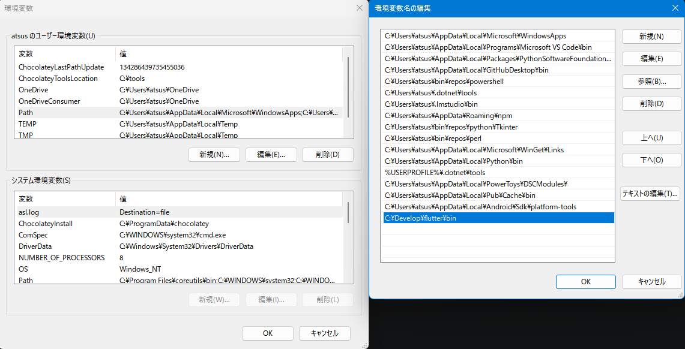](./assets/prtsc/99-02_EnvVal-delete.png)  

### AndroidStudio 削除
| | | | | | | | |  
|:---:|:---:|:---:|:---:|:---:|:---:|:---:|:---:|  
|[](./assets/prtsc/99-03_AS-icon.png) | [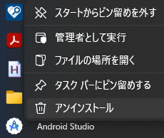](./assets/prtsc/99-04_AS-uninstall.png) | [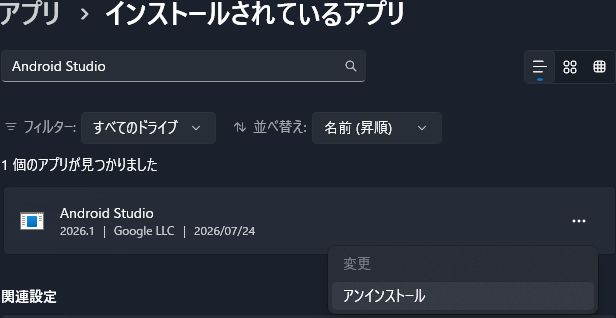](./assets/prtsc/99-05_AS-uninstall2.png) | [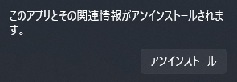](./assets/prtsc/99-06_uninstall-msg.png) | [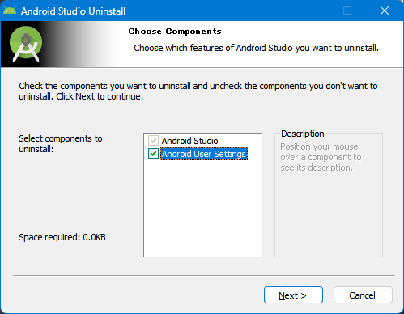](./assets/prtsc/99-07_AS-uninstall-dialog1.png) | [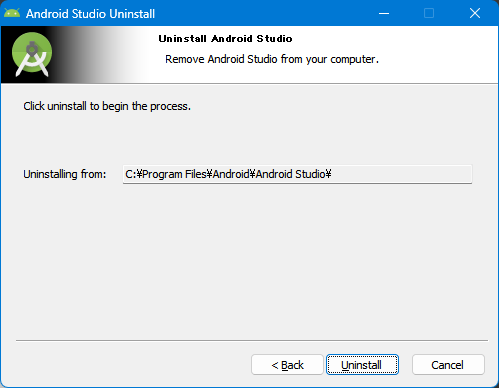](./assets/prtsc/99-08_AS-uninstall-dialog2.png) | [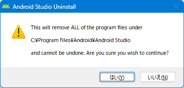](./assets/prtsc/99-09_AS-uninstall-dialog3.png) | [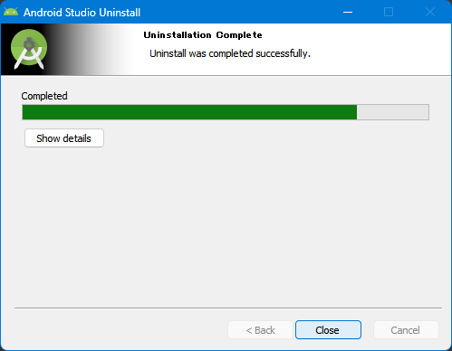](./assets/prtsc/99-10_AS-uninstall-dialog4.png) ⇒ [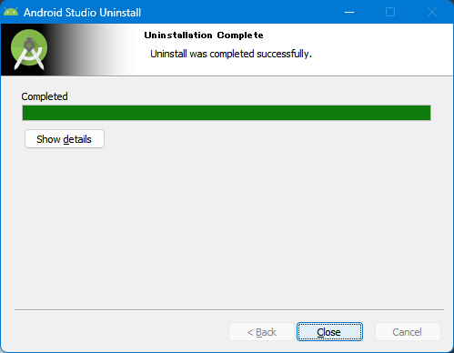](./assets/prtsc/99-11_AS-uninstall-dialog5.png) |
| icon⬇️ | 右⬇️ ⇒<br>[ｱﾝｲﾝｽﾄｰﾙ]⬇️ | [ｱﾝｲﾝｽﾄｰﾙ]⬇️ | [ｱﾝｲﾝｽﾄｰﾙ]⬇️ | [<u>N</u>ext]⬇️| [<u>U</u>ninstall]⬇️ | [はい(<u>Y</u>)]⬇️ | [<u>C</u>lose]⬇️ |  

  


　🪟⬇️ ⇒ 右️⬇️ ⇒ 
