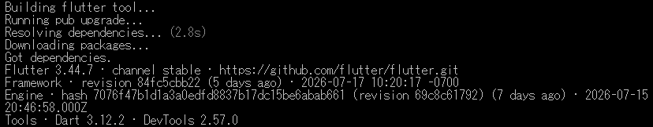
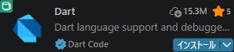
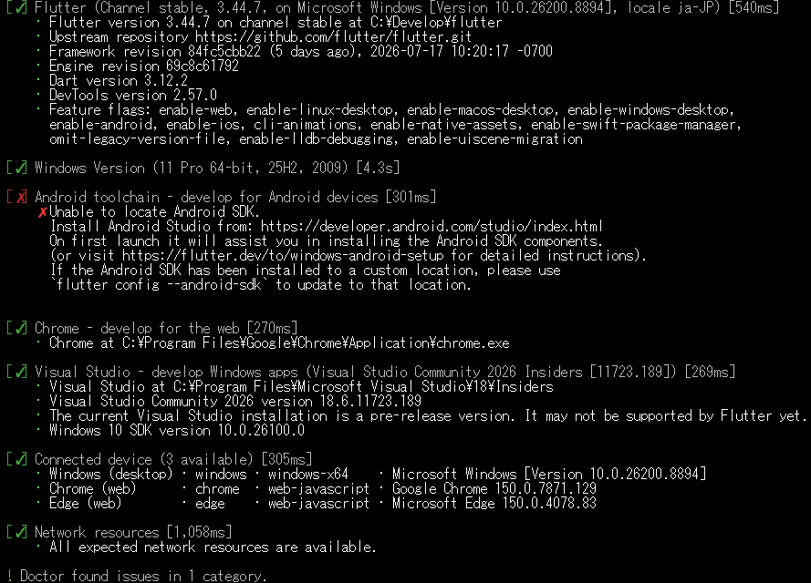
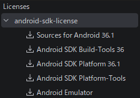
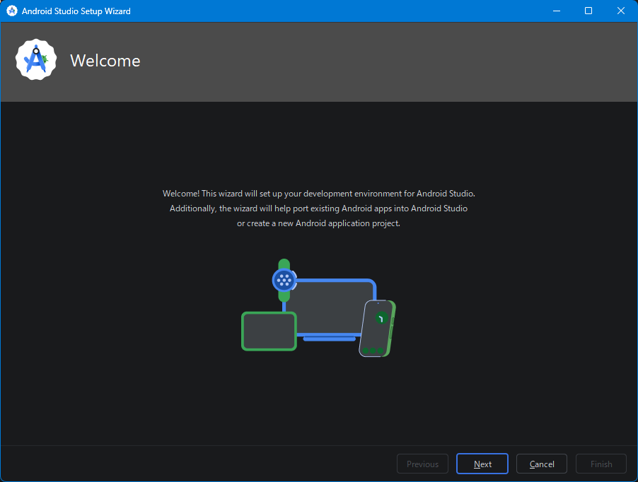
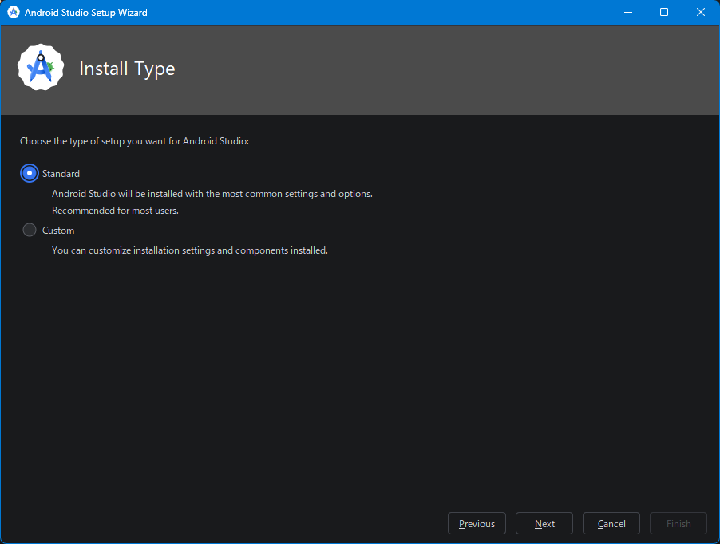
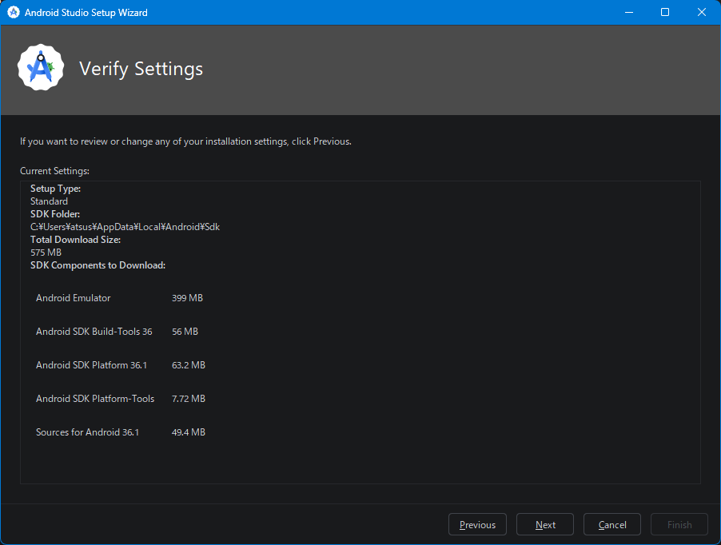
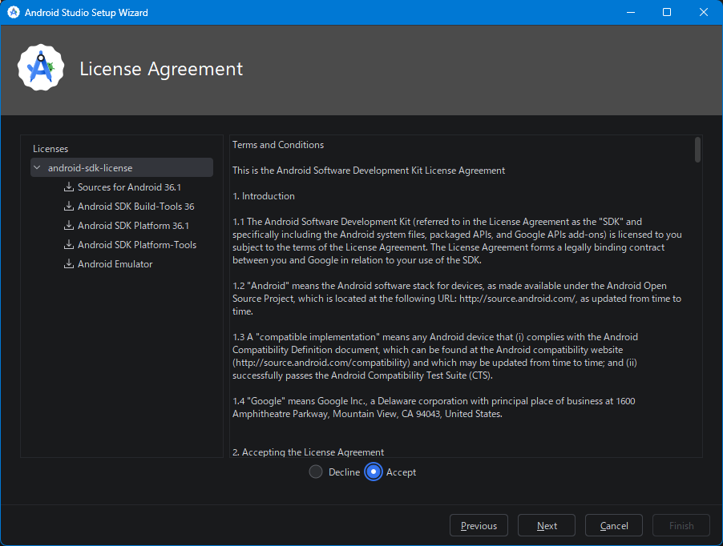
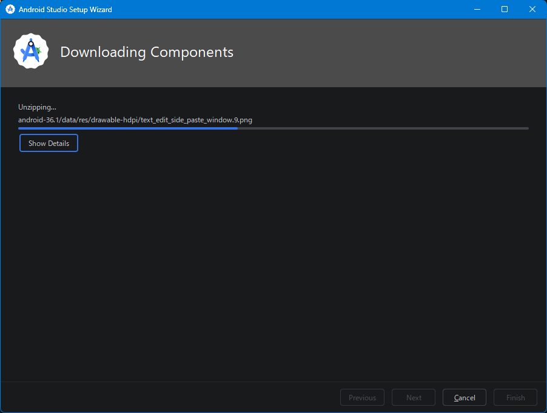
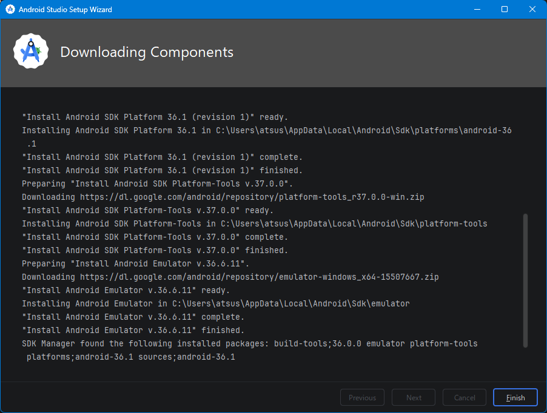

<p align="left">
	
	
</p>

## OverView
目的 : OS不問のMobileアプリケーション開発  
内容 : **Android** / **iOS** 両用開発環境を構築し、アプリケーション開発を行う  
|Item|Content|
|:--|:--|
|OS||
|言語||
|FrameWork||
|IDE||
|Editor|　　|
|検証機材||

※ 記号例
```
🪟:デスクトップ、⬇:マウスクリック、 [･･･]:ボタン、<･･･>:Press the Key、⇒:次動作、#･･･:コメント  
"･･･":テキスト、a/b:選択(a or b)、｢･･･｣:ウィンドウ/メニュー/フォーム、
```
<br>

## ファイル/フォルダーの排他的削除ツール [exrm]作成手順
### インストール
　既に現環が存在する場合は末尾の｢現環境削除｣参照  
　**Flutter**  
　　**SDK**と**VS Code**用プラグイン  
　　　🔗[Install Flutter manually](https://docs.flutter.dev/install/manual) /  [flutter_windows_x.xx.x-stable.zip]  
　　　**.zip** 解凍後、任意のフォルダへコピー  
　　　　推奨 : 🗁 C:\Develop\Flutter 　# 新規作成、管理者権限不要で参照しやすい位置  
　　🪟｢🔍検索｣へ"**環境変数**"入力 ⇒ ｢環境変数を編集｣⬇️ ⇒  
　　🪟｢環境変数｣ ⇒ ｢…のユーザー環境変数(U)｣ ⇒ ｢Path｣⬇️ ⇒ [編集(E)...] ⇒   
　　🪟｢環境変数名の編集｣ / [新規]⬇️ ⇒ "C:\Develop\flutter\bin"追加 ⇒ [OK]⬇️ ⇒ [OK]⬇️  
　　PowerShell再起動  

### インストール確認  
　  
　```pwsh
flutter --version <⏎>  
　```
  
　```pwsh
dart --version <⏎>  
　```
  

### VS Code への機能拡張追加
　  
　```
<^>+<⇧>+<x> ⇒ 左ペインで "Flutter" / "Dart" 検索 ⇒ Flatter / Dart インストール
　```
　  

### Flutter初回診断
　  
　```
flutter doctor -v <⏎>
　```
  
> [!IMPORTANT]
> この時点ではAndroidにエラーが出ていても問題無し  
> Flutterがインストールされていれば **OK**  

### AndroidStudio インストール
　インストーラ入手 : [ [Download Android Studio Quail 2] ](https://developer.android.com/studio?hl=ja)  
　　  
　　デフォルト設定でインストール  
　　SDKインストール先 : 🗁 C:\Users\ユーザー名\AppData\Local\Android\Sdk  
　　  

### SDK Command_LIne_Tools インストール
　  
　```  
Menu「☰｣⬇️ ⇒ ｢Tools」 ⇒ 「SDK manager」⬇️ ⇒  
　```  
| Welcome | InstallType | VerifySettings | LicenseAgree| DwnloadingCmp|
|:---:|:---:|:---:|:---:|:---:|
|[](./assets/prtsc/04-03_Welcome.png) |[](./assets/prtsc/04-04_InstallType.png) |[](./assets/prtsc/04-05_VerifySettings.png) |[](./assets/prtsc/04-06_LicenseAgreement.png) |[](./assets/prtsc/04-07_EownloadingComponents1.png) ⇒ [](./assets/prtsc/04-08_EownloadingComponents2.png)|
|[<u>N</u>ext] |[⦿Standard] ⇒ <br>[<u>N</u>ext] |[<u>N</u>ext] |[⦿Accept] ⇒ <br>[<u>N</u>ext] |wait… [<u>F</u>inish]|


<br>
<br>
<br>
<br>
<br>
<br>
<br>
<br>
<br>
<br>
<br>
<br>
<br>
  
　右下[Apply]⬇️ ⇒ [OK]⬇️

### Android ライセンス確認
　  
　```
flutter doctor --android-licenses <⏎>
　```
　  

### Emulator 起動  
　  
　```
Menu「☰｣⬇️ ⇒ ｢Tools」 ⇒ 「SDK manager」⬇️ ⇒  
　```  
　  


## VisualStudio起動
## UIモジュール作成  
## イベント処理モジュール作成  
## ロジックモジュール作成  
## クラス指定明確化  
## プロジェクトファイル変更(WinFormsの有効化、単体起動exe作成コマンド)  
## テスト環境構築  
## バージョン管理登録(Git)  
### Git README.md 編集  
## ターミナル表示  
### Test環境構築  
## 動作確認  
### アプリ起動  
### 試行 ( 🗀test1st で実施 )
## 単体アプリ作成  
### バージョン指定
### icon 作成
### Visual Studio  
### Visual Studio使わない方法  
## Git 更新 (README.md、exrm.exe)  
　｢VisualStudio｣  
　　右下の｢🖋️アイコン｣ ⬇️  
　｢Git 変更｣  
　　変更 / 追加したファイルをフォーカスし｢＋｣ ⬇️  
　　　｢メッセージを入力してください <必須>｣ にコメント入力  
　　[すべてをコミット] ⬇️  


<br>  
<br>  
<br>  
<br>  


## 現環境削除(必要に応じて)  
### 現状確認
　  
```pwsh
where.exe flutter <⏎>
　　　　:　# Output Message
flutter doctor -v <⏎>
　　　　:　# Output Message
Get-ChildItem Env: Where-Object {
        $_.Name -match 'ANDROID|JAVA|FLUTTER|DART|GRADLE|PUB'
    } Sort-Object Name <⏎>
　　　　:　# Output Message
$env:Path -split ';' Where-Object {
        $_ -match 'flutter|android|dart|gradle|java'
    } <⏎>
　　　　:　# Output Message
```
