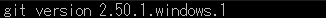

<p align="left">  
	  
	  
</p>  
  
# OverView  
#### 目的 : リハビリテーション(姿勢保持動作)支援アプリケーションの作成<br>　　　OS不問のMobileアプリケーション開発<br> 内容 : **Android** / **iOS** 両用開発環境を構築し、アプリケーション開発を行う  
|Item|Content|  
|:--|:--|  
|OS||  
|言語||  
|FrameWork||  
|IDE||  
|Editor|　　|  
|検証機材||  
  
　※ 記号例  
```  
　🪟:デスクトップ、⬇️:マウスクリック、 [･･･]:ボタン、<･･･>:Press the Key、⇒:次動作、#･･･:コメント  
　"･･･":テキスト、a/b:選択(a or b)、｢･･･｣:ウィンドウ/メニュー/フォーム、  
```  

# リハビリテーション用タイマー&カウンター[tmct]作成手順  

> [!NOTE]
> 各画像は⬇️で拡大します。
## インストール  
　既に現環が存在する場合は末尾の ｢**現環境削除**｣ 項参照  
### 環境確認  
　  

```pwsh  
　git --version <⏎>  
```  
　　  
```pwsh
　code --version <⏎>  
```  
　　  

## Flutter インストール  
　　👇ボタンより FlutterSDK バンドルをダウンロード  
　　[](https://storage.googleapis.com/flutter_infra_release/releases/stable/windows/flutter_windows_3.44.8-stable.zip)  🔗[Install Flutter manually](https://docs.flutter.dev/install/manual)  
　解凍して任意のフォルダへ保存　　推奨：🗁 C:\Develop\  

## 環境変数登録
　画面左下の  へ"環境変数"を入力して  を⬇️  
　｢･･･のユーザー環境変数(<u>U</u>)｣ ⇒ ｢Path｣ ⇒ [編集(<u>E</u>)…] ⇒ ｢環境変数名の編集｣/[新規] ⇒ 追加 "C:\Develop\flutter\bin"  
　　　[](./assets/prtsc/03-03_ControlPanel.png)  

## Flutter パス確認  
　  
```pwsh
　flutter --verison <⏎>
```  
　　[](./assets/prtsc/04-01_flutter-version.png)  
```pwsh
　dart --verison <⏎>
```  
　　[](./assets/prtsc/04-02_dart-version.png)  
  
## VS Code への機能拡張追加  
　  
　左ツールバーの 
⬇️ 、又は ⚙️⬇️ ⇒ [機能拡張　Ctrl+Shift+X]⬇️ ⇒  

　[](./assets/prtsc/04-03_VSC-flutter-ext.png)　**/**　[](./assets/prtsc/04-04_VSC-dart-ext.png)  

## Flutter初回診断  
　  
```pwsh  
　flutter doctor -v <⏎>  
```  
　　　[](./assets/prtsc/05-01_flutter-doctor.png)  
> [!IMPORTANT]  
> この時点ではAndroidにエラーが出ていても問題無し  
> Flutterがインストールされていれば **OK**  
  
## AndroidStudio インストール  
　  
　インストーラ入手  
　　🔗[Android Studio](https://developer.android.com/studio?hl=ja)　※使用許諾の必要があるため、リンク先の  よりダウンロード  
　　 W⬇️  
　　デフォルト設定でインストール  
　　SDKインストール先 : 🗁 C:\Users\ユーザー名\AppData\Local\Android\Sdk  

　　🔗[インストール方法詳細](./AS_Introdunction.md)  


### Project 作成
|Welcome to<br>Android Studio|Trust and Open<br>Project|  
|:---:|:---:|  
|[](./assets/prtsc/06-03_welcomeAS.png) |[](./assets/prtsc/06-04_trust-and-openproject.png)|  
|｢Open｣ ⬇️| ⬇️|

> [!IMPORTANT]
> **tmct_flt** は **main.dart** 及び **pubspec.yaml** を別途作成し、AndroidStudioに読み込ませています。

### SDK インストール  
　  
　　[](./assets/prtsc/06-05_menu-bar-SDKmaneger.png)  
　Menu ｢｣ ⬇️ ⇒ ｢Tools」 ⇒ 「SDK manager」⬇️ ⇒  SDKインストール   
　設定内容  
|Item|Content|Remarks|  
|:---|:---|:---|  
|SDK Platforms|Android 16.0 ("Baklava")|Emulator用なので、一般的なSDKで|
|SDK Tools|Android SDK Build-Tools<br>　　37.0.0<br>　　36.1.0<br>　　36.0.0<br>Android Eulator<br>Android SDK Platform-Tools|<br>┐<br>┼─　｢  ｣ で表示<br>┘<br> <br> <br>|  

　　🔗[SDKインストール方法詳細](./AS_SDK-Introduction.md)  

> [!IMPORTANT]
> 必要項目の左に []️ がある場合は、先にクリックしてインストールすること。  

### Device 設定  
　  
　　  
　Menu ｢️｣⬇️ ⇒ ｢Tools」 ⇒ 「SDK manager」⬇️ ⇒  スマートフォンイメージ インストール   

　設定内容  
|Item|Content|Remarks|  
|:---|:---|:---|  
|name|Pixcel 7||
|API|API 37.0 "CinnamonBun";Andoid17||
|Services|Google Play Store||
|System Image|16KB Page Size Google Play<br>Intel x86 64 Atom System Image||

　　🔗[Device設定方法詳細](./AS_Device-Introduction.md)  
> [!IMPORTANT]
> 必要項目の左に []️ がある場合は、先にクリックしてインストールすること。  


### Android ライセンス承認  
　  
```pwsh
　flutter doctor --android-licenses <⏎>  
```  
　
　以降、何度か"Accept? (y/N)"と聞かれるので、全て\<y\>で **OK**  

<br>

　  
　上記メッセージを確認できれば承認完了。
  
### Emulator 起動  
　  
　Menu ｢️｣⬇️ ⇒ ｢Tools」 ⇒ ｢Device Manager｣⬇️ ⇒  
　　  

　｢Device Manager｣⬇️ ⇒ ｢**＋**｣⬇️ ⇒ ｢Create Virtual Device｣⬇️  
　　     
　　[](./assets/prtsc/03-07_Emulator-Pixcel7-1st.png)  

<br>

## tmct_flt 作成  
> [!NOTE]  
> コマンドは全て   
> Emulator が起動した状態で実施  
### 開発環境確認  
　```  
　flutter doctor -v <⏎>  
　```  
  

　```
　flutter devices <⏎>  
　```  
  

### Android フォルダ生成  
> [!TIP]
> .dart、.yaml、.xmlのバックアップをお勧めします。  
>   
>   

　```
 flutter create --platforms=android --project-name tmct_flt . <⏎>
　```
　  

### パッケージ取得
　```
　flutter pub get <⏎>
　```  
　  

### アイコン生成  
　```
　flutter pub add --dev flutter_luncher_icons <⏎>
　```  
　  

　```
　dart run flutter_launcher_icons <⏎>
　```  
> [!IMPORTANT]
>   
> エラー発生時は "🗋 pubspec.yaml" を確認
> iosが "ios: **true**" になっていれば変更 ⇒ "ios: **false**"　# 現状Android版のみのため  
　  

　```  
　flutter analyze <⏎>
　```  
　  

> [!IMPORTANT]
>   
> エラー発生時は "🗁 test" を削除  

　```
　flutter devices <⏎>  
　```
　  

### Emulatorで実行  
　"flutter devices"で確認したデバイスIDを指定する事。  
　```
　flutter run -d emulator-5554 <⏎>  
　```  
[](./assets/prtsc/03-21_emulation-install.png) 
　
　[](./assets/prtsc/03-22_emulation-tmct_flt.png) 
　
　[](./assets/prtsc/03-23_emulation-home.png)
> [!TIP]
> 基本的な動作確認を行っておきます

<br>

## 配布版作成  
　  
　```  
　flutter clean <⏎>  
　```  
　```  
　flutter pub get <⏎>  
　```  
　  
　```  
　flutter pub get <⏎>  
　```  

 <⏎>  

<br>
<br>
<br>
<br>
<br>
 <⏎>  