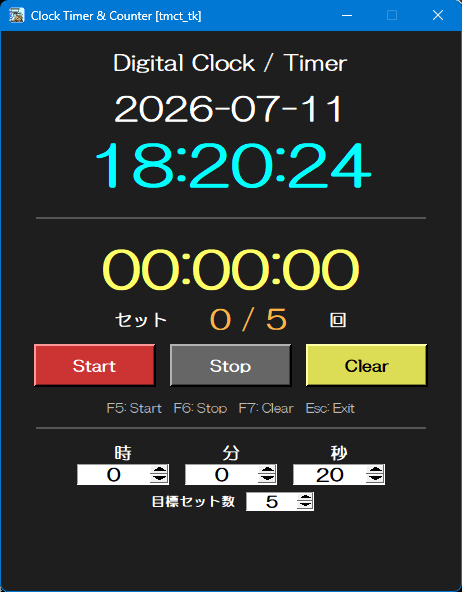

<p align="left">
  
  
</p>

# Clock Timer & Counter [tmct_tk]
<p align="left">
  
</p>
<br>

## Overview
日付・現在時刻・カウントダウンタイマー、タイマー実行回数を表示するデスクトップアプリです。  
タイマー終了時に完了セット数を自動で加算し、目標セット数までの進捗を表示します。  
リハビリやストレッチ、一定時間の姿勢維持などに利用できます。  
<br>

## Purpose
* 日付･現在時刻(秒表示)  
* カウントダウンタイマー  
* Start / Stop / Clear  
* 残り10秒から 赤 ⇒ 黄 ⇒ 赤 と変化  
* タイマー実行回数の自動カウント  
* ストップ後の停止時間からの再スタート 
* F5 / F6 / F7 のショートカット操作  

<br>

## Features
* リハビリテーション(姿勢の維持時間測定)  
* リハビリテーション(メニュー実施回数カウント)  
* インスタント食品の調理時間計測
* 標準ライブラリによる軽量アプリケーション(**Tkinter**)
* 単体exeで実行可能（Windows）
* Windows / Linux でのCLI実行
<br>

## Usage
1. 時･分･秒を設定 (数字指定又は上下ボタンによる増減)
2. 実行回数設定 (数字指定又は上下ボタンによる増減) 
3. [Start] ⇒ 時間経過(残り10秒で表示色変化) ⇒ 停止 ⇒ 自動リセット
3. 場合により[Stop] ⇒ [Start(停止秒から再開)]
4. [Clear]で設定変更
<br>

## Use Case
- リハビリテーションでの一定時間姿勢保持を支援
- インスタント食品の調理時間計測
- その他一般的な作業の時間計測及び回数確認
<br>

## UI Components
### Input items
>| Item | Description |
>| :--| :--|
>| YYYY-MM-DD| 現在日付 |
>| HH:MM:SS | 現在時刻 |
>| HH:MM:SS | カウントダウン残時間 |
>| セット Count / Limit | 繰り返し回数 |
### Buttons
>| Item | Description |
>| :--| :--|
>| Start | カウントダウン開始 |
>| Stop | カウントダウン停止 |
>| Clear | 時間、回数リセット |
>| 時 | タイマー時 設定 |
>| 分 | タイマー分 設定 |
>| 秒 | タイマー秒 設定 |
>| 目標セット数 | タイマー実行回数 |
<br>

## Tech Stack
* Python 3.x
* Tkinter
<br>

## Design / Implementation Points
- タイマーとその実行回数確認に特化
- 説明を不要とするUI
- タイマー再開時のストップ時間保持
- 残り10からの表示色変化によるラストスパートの視覚的サポート
<br>

## Why Tkinter
本ツールはPython標準ライブラリのみの構成と動作の軽快性を重視し、Tkinter を採用しています。
- 動作の軽快感
- 外部ライブラリ不使用による実装の容易化
- デスクトップユーティリティに適した構成
<br>

## Build (for developers) 
&emsp;   
```
pyinstaller ^  
  --noconsole ^  
  --onefile ^  
  --icon=tmct_tk.ico ^  
  --add-data "tmct_tk.ico;." ^  
  --version-file=tmct_tk.version ^  
  tmct_tk.py  
```  

## Documentation  
Doxygen により生成できます。  
　⇒ ソースコードの可読性向上と構造理解を目的としています。  
&emsp;   
　```
doxygen Doxyfile
　```
<br>

## Download
&emsp; 🔗 https://github.com/AHazeyama/public/releases/latest  
<br>

## License
&emsp; TBD
